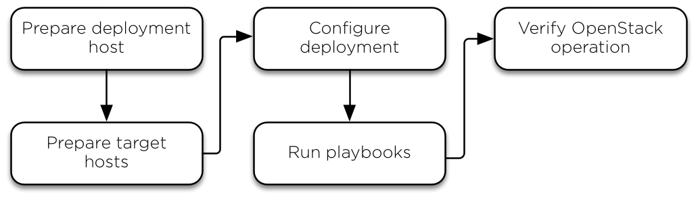

- OpenStack Ansible: https://github.com/openstack/openstack-ansible
- CERN OpenStack Guide: https://clouddocs.web.cern.ch/

## Concepts

| Component                        | Description                                                  |
| -------------------------------- | ------------------------------------------------------------ |
| OpenStack Compute (Nova)         | OpenStack compute is the component which allows the user to create  and manage virtual servers using the machine images. It is the brain of  the Cloud. OpenStack compute provisions and manages large networks of  virtual machines. |
| Block Storage (Cinder)           | This component provides persistent block storage to running  instances. The flexible architecture makes creating and managing block  storage devices very easy. |
| Identity Service (Keystone)      | This provides a central directory of users mapped to the OpenStack  services. It is used to provide an authentication and authorization  service for other OpenStack services. |
| OpenStack Image Service (Glance) | This provides the discovery, registration and delivery services for  the disk and server images. It stores and retrieves the virtual machine  disk image. |
| Dashboard (Horizon)              | This component provides a web-based portal to interact with all the underlying OpenStack services, such as NOVA, Neutron, etc. |
| Orchestration (Heat)             | This component manages multiple Cloud applications through an  OpenStack-native REST API and a CloudFormation-compatible Query API. |
| Containers (Magnum)              | Provides Kubernetes and Docker as a service                  |
| Networking (Neutron)             | Cloud networking to provide connectivity for VM and bare metal |
| Bare Metal (Ironic)              | Managing hardware resource allocation and control            |
| Workflow (Mistral)               | Provides workflows as a service for programmed tasks         |
| Shares (Manila)                  | Cluster filesystems as a service to allow concurrent sharing of storage |
| Image                            | A virtual machine image is a single file that contains a virtual disk  that has a bootable operating system installed on it. Images are used to create virtual machine instances within the cloud. |
| Volume                           | Volumes are block storage devices that you attach to instances to enable persistent storage. You can attach a volume to a running instance or  detach a volume and attach it to another instance at any time. |
| Snapshot                         | A snapshot provides a copy of a currently running VM or volume which can be restored. |
| Hypervisor                       | The hypervisor interacts directly with the underlying hardware,  abstracting its resources such as CPU, memory, storage, and networking.  It presents a virtualized view of these resources to the guest operating systems. |
| Guest Isolation                  | The hypervisor creates isolated execution environments called virtual  machines. Each VM runs its own guest operating system along with its  applications. The hypervisor ensures that the VMs remain isolated from  each other, preventing interference and conflicts between them. |
| Resource Allocation              | The hypervisor manages the allocation of physical resources to the VMs.  It divides the physical CPU into multiple virtual CPUs (vCPUs) and  assigns them to the VMs based on their resource requirements. Similarly, it allocates memory, storage, and network resources to the VMs as  needed. |
| Type 1 (bare-metal) Hypervisor   | Type 1 hypervisors run directly on the underlying hardware   |
| Type 2 (hosted) Hypervisor       | Type 2 hypervisors run on top of an existing operating system |
| KVM                              | KVM is a type 1 hypervisor that integrates with the Linux kernel,  providing a powerful and efficient virtualization platform for running  multiple guest operating systems on a single physical machine. |
|                                  |                                                              |

## Deployment

