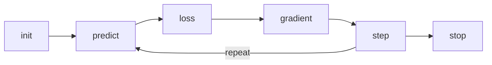

Given a vector of weights `w`, we want to find its specific values that causes the result of the function `sum(x * w)` to be high for inputs `x` that are correct and low for those that are not.

1. _initialize_ the weights **randomly**
2. for each input, use these weights to _predict_ whether what it _appears_ to be (e.g. which number)
3. based on these predictions, **calculate how good the model** is (its _loss_)
	- some function that will return a number that is small if the performance of the model is good
4. calculate the _gradient_, which measures for each weight, **how changing that weight would change the loss**
5. _step_ (that is, change) all the weights based on that calculation.
6. go back to the step 2, and _repeat_ the process.
7. iterate until you the model is _good enough_ (or the AWS bill is too expensive)

## How to calculate the gradient?

The simplest approach is to just try different weights (increase it bit or decrease it bit) and check if the loss goes up or down. This can be repeated until an _acceptable_ weight is found.

![[fsquared.png|300]]
- the above function is: `f(x) = x**2
- starting a point **A** change the weight a bit (**B**)
- repeat until a local optima is found (**C**)
- every function can be optimized this way
- but this approach is expensive

### Better approach

- _derivative_ tells us how much a change of the parameters of a function will change its result
- the _derivative_ tells us the slope of the function, which is useful in order to decide how far to adjust the parameters
	- if the slope is large, it might be a good idea to improve the parameters further
	- if the slop is small, improving the parameters won't matter much
- guess a learning rate between 0.0001 and 0.1
- adjust the parameters repeatedly: $w \mathrel{{-}{=}} gradient(w) * lr$

#### Example

Let $f(x) = x^{2}$ be the function, pick a learning rate of $lr=0.05$ and start with the weight $w=-4$. Remember that the goal is to minimize the result of $f(w)$ (the loss). Then the process roughly looks like this for $w \mathrel{{-}{=}} gradient(w) * lr$:

1. $-4 \mathrel{{-}{=}} gradient(-4) * 0.05 = -4 + 0,4 = -3.6$
2. $-3.6 \mathrel{{-}{=}} gradient(-3.6) * 0.05 = -3.6 + 0,36 = -3.24$
3. $...$
99. $-0.2 \mathrel{{-}{=}} gradient(-0.2) * 0.05 = -0.2 + 0,02 = -0.18$

From the example above it gets obvious that the gain decreases the more we approach the optimum: