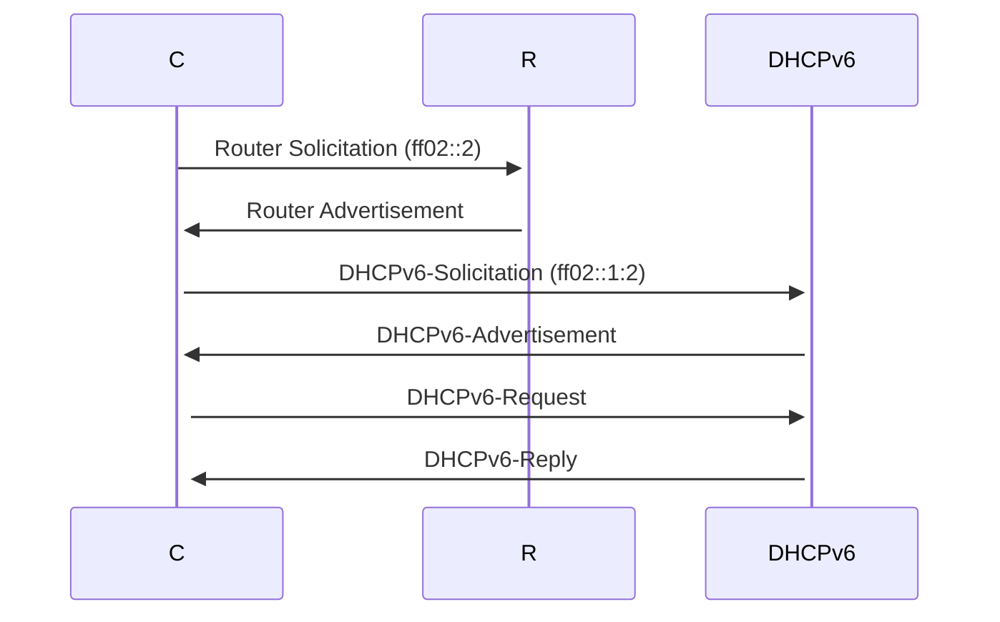

- not required, because clients can obtain a global IPv6 address stateless (see [[IPv6#SLAAC]])
- DHCPv6 is **stateful**
- **stateful** and **stateless** address configuration may coexist on the same network

## Procedere

Let **C** be a client on the local network and **R** be a router.

0. C generates a link-local address for the current link (valid until the next router)
1. C sends a [[ICMPv6#RS - Router Solicitation| Router Solicitation]] to the multicast address `ff02::2` asking for a prefix
2. R answers with a matching [[ICMPv6#RA - Router Advertisement|Router Advertisement]] and includes information about the MTU, optionally the prefix. In case of a DHCPv6 it **sets the managed flag**
3. C sends a DHCP-Solicitation message to `ff02::1:2` (all DHCPv6 servers on the same network)
4. all DHCPv6 servers answer with a DHCP-Advertisement which contains information about DNS servers, NTP servers and so on. This advertisement may also contain the global prefix.
5. C chooses any of the offered IP address configurations and requests it explicitly from the corresponding DHCPv6 server
6. the DHCPv6 server creates a DHCP lease and responds with an DHCPv6-Reply