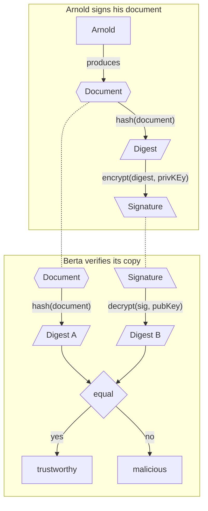

## Terminology
- **Asymmetric cryptography:** private and public key. <mark>Either of which can be used to encrypt data while only the other can be used to decrypt it.</mark>
- **Hash Function:** one-way <mark>mathematical function to process data of  arbitrary length to produce a fixed-length result</mark> (called digest)
- **Iterative DNS query:** "*gimme whatever help you can but ask no one else*"
- **Recursive DNS query:** "*gimme what I need and ask everyone you want"
- **Fingerprint:** hash digest of of public key
- **KSK (Key singing key pair):** <mark>used to sign/verify a  ZSK</mark>
- **ZSK (Zone signing key pair):** <mark>used to sign/verify a domain's/zone' non-key records </mark>(e.g. DS records or A/AAAA records)
- **RRSet:** set of records with the <mark>same type and same domain</mark>
- **RRsig:** a record containing a RRset's digital signature (`encrypt(hash(RRset), privKey)`) 
- **DS record:** a record containing the hash digest of a child's zone pubKSK

### Digital Signatures

