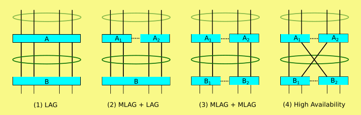

- **LAG (Link Aggregation Protocol):** joins multiple physical links to a single logical link
- **MLAG (Multiple-Chassis Link Aggregation):** extension of LAG. Adds node-level redundancy to the normal link-level redundancy that a LAG provides (multiple switches)
- **LACP (Link Aggregation Control Protocol):** protocol for dynamic LAGs

### LACP

- **link aggregation group** (**LAG**) is the combined collection of physical ports
- https://en.wikipedia.org/wiki/Link_aggregation#802.1AX
- can be configured in different ways
	- round robin for more bandwith
	- active-backup for redundancy
	- and more
- L2 or L3 hashes may be used to prevent packet reordering
	- the same flow is always sent via the same physical link

### MLAG

- multiple vendor specific proprietary implementations
- not interoperable
- node-level redundancy to the normal link-level redundancy that a LAG 
- two switches are interconnected and work together to form a virtual switch
- ==share a common control plane, which enables them to synchronize  certain aspects of their operations, such as MAC address tables and link state information==
- this synchronization ensures that the switches  appear as a unified entity to the connected devices

MLAG allows for the creation of aggregated links (LAGs) that span both  switches, providing redundancy and load balancing across the links.  Connected devices can then connect to the MLAG as ==if they were connected to a single switch==, benefiting from the combined bandwidth and failover capabilities. For the creation of the LAG the regular LACP protocol can be used, because the MLAG construct behaves like a single switch. The connecting peer using LACP does not even know that there are multiple physical switches.

While MLAG is commonly used with a pair of switches, it's worth noting  that there are variations and alternative technologies that can provide  similar functionalities with more than two switches, such as Virtual  PortChannel (vPC) in Cisco Nexus switches or Distributed Multi-Chassis  Link Aggregation (dMLAG) in certain vendor-specific implementations.  These variations expand the capabilities of MLAG-like technologies to  involve multiple switches while still providing redundancy and load  balancing features.
