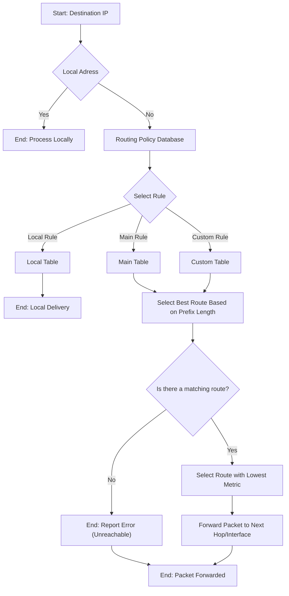

# Routing

- [Routing](#routing)
  - [Abstract Comparison](#abstract-comparison)
  - [Technical Routing vs. Policy Routing](#technical-routing-vs-policy-routing)
    - [Analogy](#analogy)
  - [Evaluation Order](#evaluation-order)
  - [Examples](#examples)
    - [Inspect Rules](#inspect-rules)
    - [Custom Rule](#custom-rule)
    - [Route vs. Rule](#route-vs-rule)
    - [BGP](#bgp)

## Abstract Comparison

When routing IP packets each router considers as much of the address as  it knows to address. This works similar to a post office that only looks at the state and city of the address on the letter while ignoring the  street or number, because post offices only route letters roughly in the right geographical region. The mailman on the other hand considers the  street and number, because he is concerned with the precise delivery.

**Router as Post Office:** Just as a post office looks at the state and city to route the letter to the right geographical region, each router in an IP network looks at the destination IP address of a packet to determine the next hop in the network. Routers are concerned with directing packets towards their final destination but don't need to know the exact "street and number" (or in networking terms, the exact final endpoint within the smaller network).

**Mailman as Final Delivery:** The mailman, who delivers the mail to the exact street and number, is akin to the last mile routing typically performed by a switch or a local router within a smaller network (like a LAN). At this point, the packet is in the correct local area and needs specific handling to reach the exact device or "house" in the analogy.

## Technical Routing vs. Policy Routing

There are two broad categories:

- **Technical Routing**
  - technical aspects of routing packets from A to B
  - shortest path algorithm or routing algorithm
  - OSPF, BGB, ...
- **Policy Routing**
  - high level policies
  - based on source address, the IP protocol or transport protocol

### Analogy

A schizophrenic router maintains two routing tables, one for each interface. The router, among others, has two interfaces. On one interface, it receives secret information from the government, while the other serves as the janitor's uplink. The router may route the secret government traffic differently, as cost is not the primary concern; instead, a more "secure" path might be preferred. Conversely, the janitor's traffic, likely to be for leisure activities such as YouTube, is routed through the cheapest available path.

## Evaluation Order

==Do not mix routing tables and rules. Rules point to routing tables. Rules point to tables.==



Before the kernel looks up the main routing table, it consults the  Routing Policy Database (RPDB). The RPDB contains ==rules that determine  which routing table to use==. These rules are evaluated in order of  priority, from lowest to highest (i.e., the lower the number, the higher the priority). By default, there are three rules:

- **local**: local and broadcast addresses.
- **main**: main routing table (default of `ip route show`)
- **default**: default routes

Once the appropriate rule is matched, the kernel consults the specified routing table. The default routing table is the "main" table, but  custom tables can be defined for advanced routing needs. Each table  contains a set of routes, each specifying a destination network, a  next-hop router, and other route attributes. The kernel selects the  route with the longest prefix match (the most specific match) to the  destination IP.

The kernel selects the route based on ==various metrics, including the  route's prefix length (longest prefix match), cost, and other factors==.  It then forwards the packet to the next hop indicated by the route or  directly to the destination if it's within the local network.

**Why is the prefix length the most important indicator?**

The prefix length is the most important indicator in IP routing  decisions because it determines the specificity of the route to the  destination IP address. A more specific route is always preferred, because it leads to more precise and efficient routing.

A router prioritises the longest prefix match before considering the metric  value. This means that ==even if a route has a higher cost (or metric), it will be preferred over other routes with shorter prefix matches==.

## Examples

Let's route `93.184.216.34`.

- Check local rule? -> No.
- Check main rule
  - May contain two routes
    - `10.0.0.1/24 via eth0`
      - no match
    - `0.0.0.0/0 via eth0`
      - matches everything
- routed via default route

### Inspect Rules

```bash
$ ip rule list
0:      from all lookup local
32766:  from all lookup main
32767:  from all lookup default
```

- the first integer is the priority
- the second part `from all` is a selector to match packets
  - _"match all sources"_

### Custom Rule

```bash
$ ip rule del priority 5000
$ ip rule add from 10.0.0.0/24 priority 5000 prohibit
$ ip route flush cache
```

### Route vs. Rule

`ip route show` only lists the rules from table `main`. Use `table <table_name>` to inspect other tables:

`ip route show table local`

### BGP

- [BGP Security challenges by ACM](https://dl.acm.org/doi/pdf/10.1145/2668152.2668966)
- [RIS-Live](https://ris-live.ripe.net)
