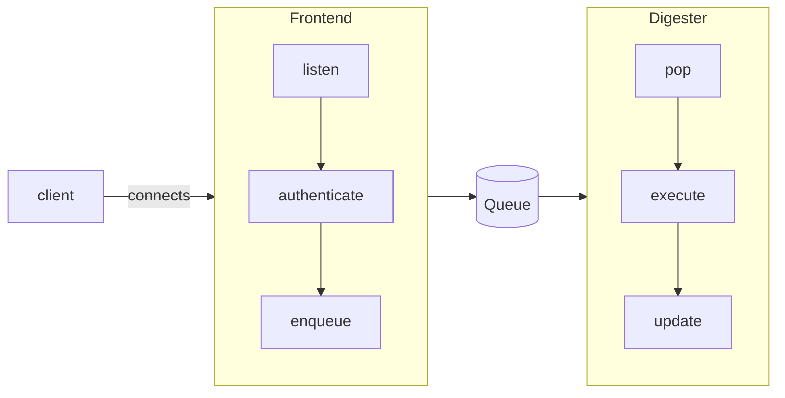

## How to handle a high demand for connections?

See the folder [multiple_connections_demo](./multiple_connections_demo/) for a demo implementation using Python.

**Problem:**

- **one socket per client is EXPENSIVE**
- inefficient use of resources
- overhead of creating and destroying threads

**Solution**

- decouple connection handling (frontend) and logic from each other
- group multiple connections in the same thread
- these frontend threads only handle connections and authentication
- incoming messages are put in a FIFO queue
- a dedicated thread pool reads from the queue
- handles the messages and executes business logic
- thread pool continuously **monitor the queue** for new task
- threads are **created in advance** -> no overhead per task

