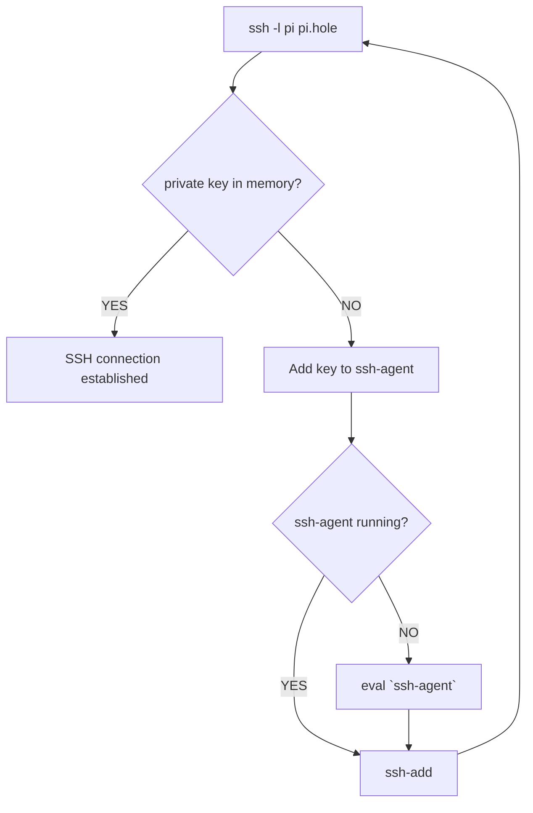

# SSH

## Basics
SSH uses public key authentication. In order to authenticate via SSH, a user creates a key pair. Each such key pair includes **two** keys:

- A **public key**which is copied to the SSH servers. This key can be publicly shared, hence it's name **public**. In order to log in, such a key needs to be added to the **authorized_keys** file.
- A **private key** that remains private on the users machine. With this key you can proof your identity. Private keys used for authentication are called **identity keys*.


## ssh-agent
- Allows users to keep track of identify keys and corresponding passphrases. As a user you just need to type your passphrase once.
- Start a new agent (usually done by the login shell)
	- ``` eval `ssh-agent` ```
- Check if `ssh-agent` is running
	- `echo $SSH_AGENT_SOCK`
- List accessible keys:
	- `ssh-agent -l`

- a typical flow when working with ssh-agent




## ssh-add
- used to add new keys to a running `ssh-agent`
- Add default keys:
	- `ssh-add`
- Add a specific key
	- `ssh-add <PATH_TO_KEY>`
	- `ssh-add ~/.ssh/awesome_key`

```bash
# If no ssh-agent is running, you need to enter your password every time
$ ssh pi@pi.hole
Enter passphrase for key '/home/leon/.ssh/id_rsa': ...

# Doing it again will yield the same password prompt
$ ssh pi@pi.hole
Enter passphrase for key '/home/leon/.ssh/id_rsa':

# Now start your ssh-agent
$ eval `ssh-agent`

# Add your default key
$ ssh-add

# Now you can access the remote without entering a password
$ ssh pi@pi.hole
$ ssh pi@pi.hole
pi@raspberrypi:~ $
```


**TIP**
Since [Version 7.2](https://www.openssh.com/txt/release-7.2) of `openssh` it is possible to add the `AddKeysToAgent yes` option to your `.ssh/config`. When enabled, a private key that is used during authentication will be added to ssh-agent if it is running (with confirmation enabled if set to 'confirm').

## ssh-keygen
- create a new key pair
- basic usage:
```bash
$ ssh-keygen
Generating public/private rsa key pair.
Enter file in which to save the key (/home/ylo/.ssh/id_rsa):
Enter passphrase (empty for no passphrase):
Enter same passphrase again:
Your identification has been saved in /home/ylo/.ssh/id_rsa.
Your public key has been saved in /home/ylo/.ssh/id_rsa.pub.
The key fingerprint is:
SHA256:Up6KjbnEV4Hgfo75YM393QdQsK3Z0aTNBz0DoirrW+c ylo@klar
The key's randomart image is:
+---[RSA 2048]----+
|    .      ..oo..|
|   . . .  . .o.X.|
|    . . o.  ..+ B|
|   .   o.o  .+ ..|
|    ..o.S   o..  |
|   . %o=      .  |
|    @.B...     . |
|   o.=. o. . .  .|
|    .oo  E. . .. |
+----[SHA256]-----+
```
- more complex example:
	- ```shell
	ssh-keygen -t ed25519 -C "your_email@example.com"```

## ssh-keyscan

- utility for gathering public SSH host keys
- works for multiple hosts
- designed to aid in building and verifying the ssh_known_hosts file

```bash
# Get all keys (RSA, ECDSA or  ED22519)
$ ssh-keyscan 10.0.0.1
# Get only rsa keys
$ ssh-keyscan -t RSA 10.0.0.1
# Append scanned keys to known_hosts
$ ssh-keyscan -H 10.0.2.15 >> ~/.ssh/known_hosts
```

## Keychain
There is open source tool for more convenience when working with `ssh-agent` and `ssh-add`: [Keychain](https://www.funtoo.org/Keychain). Keychain automatically connects to existing agents between sessions. Therefore you only need to enter your password once (after reboot). This has less security than creating a new `ssh-agent` for each session, but is more convenient. It can be installed via any packet manager.

If you omit the key name when calling `keychain` and add :

```bash
Host *
	AddKeysToAgent yes
	IgnoreUnknown UseKeychain
	UseKeychain yes
```

to your `/etc/ssh/ssh_config`, you will be asked to add your key only when it is first needed.

and then the following can be added to `~/.bash_profile`:

```bash
# Start keychain - only add each passphrase once after reboot
# --clear -> passphrases must be re-entered on login, but cron jobs will still have access to the unencrypted keys after the user logs out

eval "$(keychain --quiet --eval --agents ssh)"
```

Agents and keys in memory can be pruned by:

```bash
keychain -k all
```

## Manage which key is used for which machine
- `nano ~/.ssh/config`
- ```bash
	Host github.com
	  HostName github.com
	  User git
	  IdentityFile ~/.ssh/id_rsa
	  IdentitiesOnly yes```


## Best practices
- you can copy local keys to remote with [[SSH Copy ID]]
- it is fine to use the same key pair for multiple servers
- Disable password authentication on remotes
- Use a different keypair per SSH client
	- **NEVER COPY A PRIVATE KEY**
- keep your private keys encrypted
	- you can even re-encrypt existing keys via `ssh-keygen -p`

## Useful settings

If you set `StrictHostKeyChecking` to `accept-new`, SSH will add new keys to your hosts file. It would be the same like setting `StrictHostKeyChecking` to `no` and always connecting to a new host. In both cases SSH will  automatically add the key. However if a host is known and it changes its keys (created new keys, man in the middle, etc.) than the setting `accept-new` will *not* permit a connection to this host, while the setting `no` will allow it.

## sshfs

[sshfs](https://wiki.ubuntuusers.de/FUSE/sshfs/) is a FUSE module that allows to mount remote file systems via SSH.

The most simple invocation looks like this:

`sshfs user@foo-pc:/path/to-dir ~/to-dir`

Generally, it make sense to map user permissions:

`sshfs user@foo-pc:/path/to-dir ~/to-dir -o idmap=user -o uid=$(id -u) -o gid=$(id -g) `

It is also possible to add the following line to `/etc/fstab`:

`sshfs#user@foo-pc:/path/to-dir ~/to-dir fuse uid=1003,gid=100,umask=0,allow_other,_netdev,IdentityFile=/home/user/key.pub 0 0`
