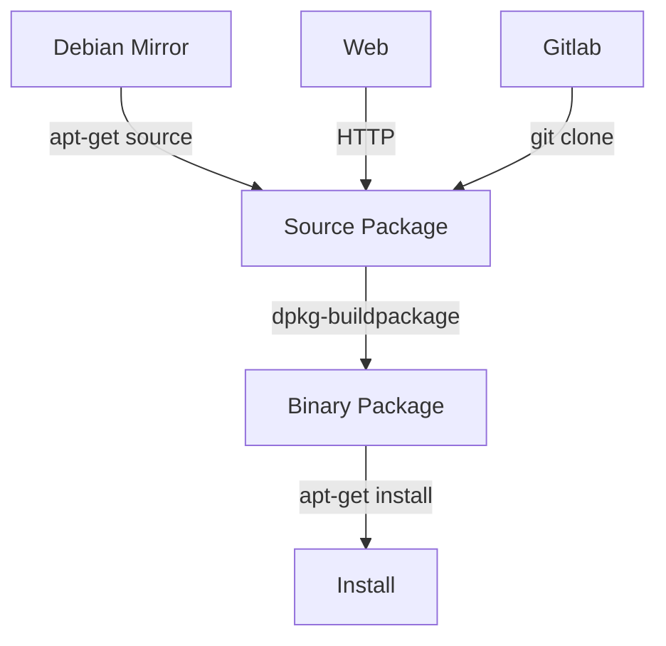

# Creating Debian Packages

## What is a Debian Package?
- collection of files that form a application or library
- consistent manner of automated installs, upgrade, configures and removes of a computer program
- each Debian package consists of two components: `source package` and `binary package`
- **Source Package**: 
	- `.dsc` file
	- provides all of the necessary files to compile or otherwise, build the desired piece of software.
	- upstream sources are bundles in a tarball
	- a description contains important metadata (name, dependencies, etc)
	- 
- **Binary Package**: 
	- `.deb` file
	- contains a ready to run program
	- knows how to add itself, remote itself and even configure itself
	- actually gets distributed and installed.

- A `.deb` can be manually constructed and can come without a source package

### Naming
- Debian Standard Naming Schema:
- `<project>_<major version>.<minor version>-<package revision>`
- only `lowercase alphanums` + `+ -` names are allowed
- `hello-debian` or `helloworld` would be okay
- `hello_debian` or `Foo/bar` are not okay

## Structure of a binary Debian package (.deb)

- binaries and resources should be placed in the same way, as they should be installed on a target system:
	- if the folder contains a `/usr/local/bin/some_exe` file
    - a executable `some_exe` would be installed into `/usr/local/bin`

- `DEBIAN` folder
    - this folder is used to hold special files, containing metadata
    - these files tell your package manager how it should install your app

- is an ar archive: `ar tv ./wget_1.12-2_amd64.deb`
- quality check via `lintian` -> `lintian ./wget_1.12-2_amd64.deb`

#### Summary
Prerequisite files [see](https://www.debian.org/doc/manuals/maint-guide/dreq.de.html):
1. one or more binary executable or shell script files
2. a man page for each executable file
3. a 'control' file -> `DEBIAN/control`
4. a 'copyright' file  -> `DEBIAN/copyright`
5. a 'changelog' and 'changelog.Debian' file --> `DEBIAN/changelog`

Setup temporary 'debian' directories:
1. create 'debian/usr/bin' directory 
2. create 'debian/usr/share/man/man1'
3. create 'debian/DEBIAN' directory
4. create 'debian/usr/share/doc/<package_name>'
5. make sure all sub directories of 'debian' have file permission `0755` (`fakeroot`)

Copy files into temporary 'debian' tree:
1. copy executable file into 'debian/usr/bin' directory (or wherever you plan to place your executable files)
2. copy man page file into 'debian/usr/share/man/man1' directory
3. copy 'control' file into 'debian/DEBIAN' directory
4. copy 'copyright', 'changelog', and 'changelog.Debian' files into 'debian/usr/share/doc/<package_name>'
5. gzip man page, 'copyright', 'changelog', and 'changelog.Debian' files with option '--best' inside the temporary 'debian' tree

Build and check binary Debian package:
1. invoke 'dpkg-deb --build' using 'fakeroot' on the 'debian' directory
2. rename resulting 'debian.deb' file to its final package name including version and architecture information
3. check resulting .deb package file for Debian policy compliance using 'lintian'

