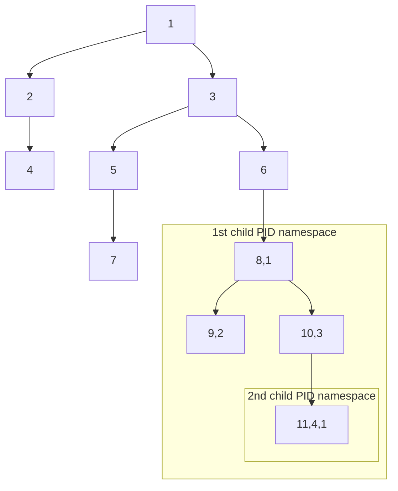

# Namespaces

Linux namespaces are a **feature of the Linux Kernel** that provide a ==mechanism for [process isolation](Processes.md) and resource allocation==. Many popular technologies that require some form of isolation are based on Linux namespaces (Docker, LXC, [Flatpak](Flatpak%20and%20Snap.md)).

The concept of namespaces is rooted in the idea of creating multiple  instances of a global resource, where each instance is independent and  isolated from others. This isolation allows processes running within  different namespaces to have their own unique identifiers for system  resources, which prevents conflicts and enables efficient resource  utilization.

## PID namespace

This namespace provides process isolation by giving each process its own unique process ID (PID) space. Processes in different PID namespaces  have separate PID numbering, so a process with PID 1 in one namespace is not the same as PID 1 in another namespace.

Instead of a single process tree, where each node is a single process, there are **multiple nested process trees**. This is a hierarchical model: With PID namespace isolation, processes in the child namespace have no  way of knowing of the parent process’s existence. However, processes in  the parent namespace have a complete view of processes in the child  namespace, as if they were any other process in the parent namespace.

=> A single process can have $N \ge 1$ PIDs.




```python3
#!/usr/bin/env python3
import os
import ctypes
import time

# Access the standard C library.
libc = ctypes.CDLL(None)

# Create stack space for the child process.
child_stack = ctypes.c_char_p(b" " * 8096)


def child_fn():
    print("Parent PID:", os.getppid())
    print("My PID:", os.getpid())
    time.sleep(15)
    return 0


def main():
    print('main PID:', os.getpid())
    # CLONE_NEWPID is the flag for creating a new namespace.
    CLONE_NEWPID = 0x20000000
    SIGCHLD = 17

    # We need the top of the stack.
    child_stack_p = ctypes.cast(child_stack, ctypes.c_void_p).value
    stack_top = ctypes.c_void_p(child_stack_p + 8096)

    # Create a C function pointer to the child_fn.
    # Normal Python functions can not be passed to C lib directly.
    child_fn_c = ctypes.CFUNCTYPE(ctypes.c_int)(child_fn)

    # Create a new (child) process
    child_pid = libc.clone(child_fn_c, stack_top, CLONE_NEWPID | SIGCHLD, 0)
    print("clone() =", child_pid)

    os.waitpid(child_pid, 0)
    return 0


if __name__ == "__main__":
    main()

```

```bash
$ sudo python3 ./ps_namespace.py 
main PID: 11481
clone() = 11482
Parent PID: 0
My PID: 1
```

- `` reports a PID of 1 meaning that its process tree is detached
  - only the first process can have the PID of 1
- from the child's perspective is 0, meaning no parent

```bash
$ ps aux
root       11479  sudo python3 ./ps_namespace.py
root       11480  sudo python3 ./ps_namespace.py
root       11481  python3 ./ps_namespace.py
root       11482  python3 ./ps_namespace.py
```

- the parent process with PID 11481 can be seen
- even though the child reports a PID of 1, we can see that it is assigned a *global* PID of 11482 which matches the output of `clone()`
- this shows that there are nested process trees

## Network namespace

## Mount Namespace

## UTS namespace

## User namespace