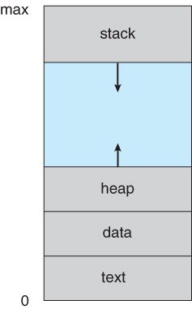
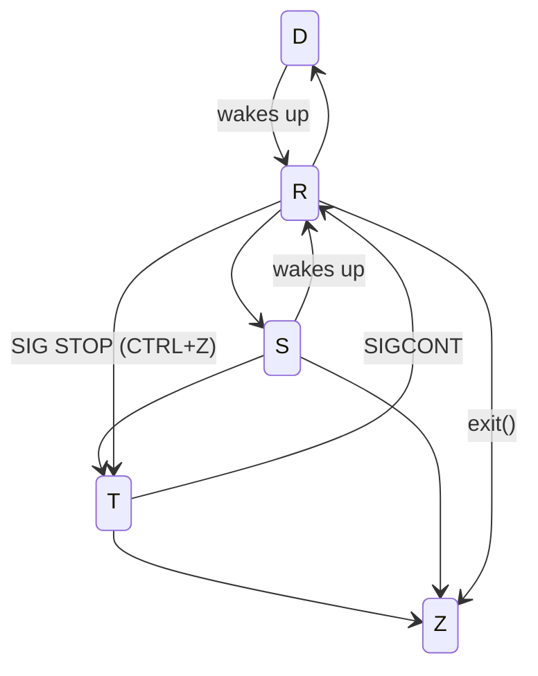
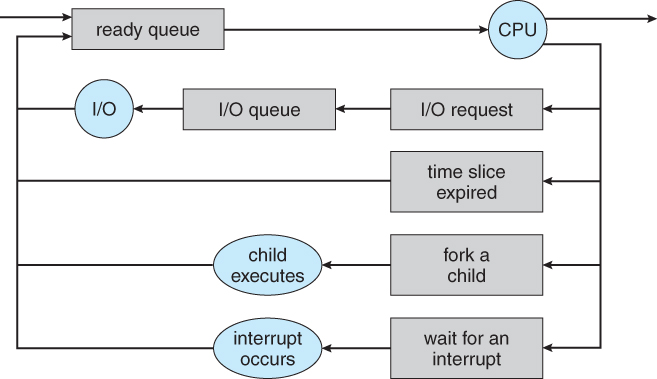

# Processes

A process is a **program** in execution, and the status of the current execution is stored in the **program counter**, as well as other **registers**.

## The Process

- The **text** section comprises the compiled program code, read in from non-volatile storage when the program is launched.
- The **data** section stores global and static variables, allocated and initialized prior to executing main.
- The **heap** is used for dynamic memory allocation, and is managed via calls to new, delete, malloc, free, etc.
- The **stack** is used for local variables. Space on the stack is reserved for local variables when they are declared ( at function entrance or elsewhere, depending on the language ), and the space is freed up when the variables go out of scope. Note that the stack is also used for function return values, and the exact mechanisms of stack management may be language specific.
- **Note** that the stack and the heap start at opposite ends of the process's free space and grow towards each other. If they should ever meet, then either a stack overflow error will occur, or else a call to new or malloc will fail due to insufficient memory available.

## States

- **R**: Running
  - if the CPU executes the process: **RUNNING**
  - if the process is ready to be executed: **RUNNABLE**
- **D**: Uninterruptible sleep
  - will not wake up from any signal
  - even if signals are sent to it
  - can not be killed
- **S**: Interruptible sleep
  - waiting for some event or signal
  - once the signal is received, the process wakes up
  - can be killed via SIGKILL: `kill -9`
- **T**: Stopped
  - suspended
  - `CTRL+Z`
  - only handles `SIGKILL` and `SIGCONT`
- **Z**: Zombie
  - terminated but not yet reaped by its parent
  - kill: `kill -s SIGCHLD parent-pid`

## Scheduling

The objective of multiprogramming is to have some process running at all times so as to maximize CPU utilization.

The role of the process scheduler is to select an available process to run the CPU.

When switching the CPU core to another process a **context switch** is required. The switching requires performing a state save of the current process and a state restore of a different process. This information is stored in the **Process Control Block**. Context switching is pure overhead, because no meaningful work is done.
## Operations

### Process Creation

- parent and child processes are organized in a tree (datastructure)
  - every child has exactly one parent
  - every process can have $0,...,N$ child processes
- each process is uniquely identified by an integer: **PID**
- the init process (e.g. `systemd`) is the first process to start ($PID=1$)
- `pstree`
- parents can execute concurrently with their children
- parents can wait for their children to terminate
- children can be duplicates of their parents (same program and data)
- children can load new programs using `exec`
- after a `fork()`:
  - a new process is created
  - with a copy of the address space of the original process
  - both processes continue at the same instruction after `fork()`
    - but the return code is 0 for the child and > 0 for the parent
- children inherit privileges and scheduling information as well as certain resources like open files

### Process Termination

- a process asks the operating system to delete it using `exit()`
  - the status code is propagated to the waiting parent
  - all allocated resources - memory, open files, etc - are deallocated and reclaimed
  - processes are not immediately removed from the process table
    - the table contains the processs exit status which is needed by the parent
    - a process that has terminated, but whose parent has not yet called `wait` is called a **Zombie**
    - all processes enter the zombie state - but typically only briefly
- parents can kill their children - but not the other way around
  - otherwise misbehaving applications could arbitrarily kill other processes

## Interprocess Communication (IPC)

### Shared Memory

- communicating processes establish a region of shared memory
- shared-memory region resided in the parent processes address space (typically)
- normally, processes can not access other processes addresses spaces
- thus, both processes need to agree to remove this restriction
- both need to agree on data, location, and read/write synchronization
- Producer-Consumer pattern
  - both processes need to create or access the same shared memory segment (`shmget()`)
  - read/write synchronization using semaphores or mutexes
  - producer writes data into the shared memory region
  - after writing the producer signals the consumer that data is available (signal or semaphore)

### Message Passing

- allow processes to communicate without sharing their address space
- particularly useful for distributed systems
- generally, $P$ and $Q$ establish a **communication link**
  -	the physical implementation varies:
    - sockets
    - pipes
    - bus
    - ...
- basic API:
  - **symmetric**
    - $send(P, message)$: send a message to process $P$
    - $receive(Q, message)$: receive a message from process $Q$
  - **asymmetric**
    - $send(P, message)$: send a message to process $P$
    - $receive(id message)$: receive a message from any process
- mailboxes allow for **indirect communication**
  - this way, processes to not need to access other processes directly
  - $send(A, message)$: send a message to mailbox/port $A$
  - $receive(A, message)$: receive a message from mailbox/port $A$
- **blocking send**: sending process is blocked until the message is received
- **non-blocking send**: the sending process resumes immediately
- **blocking receive**: the receicing process block until a message arrives
- **non-blocking receive**: the receiver retrieves a message asynchronously
- queues may be:
  - zero buffered <=> capacity of zero
  - bounded by capacity <=> fixed sized buffer
  - unbounded
