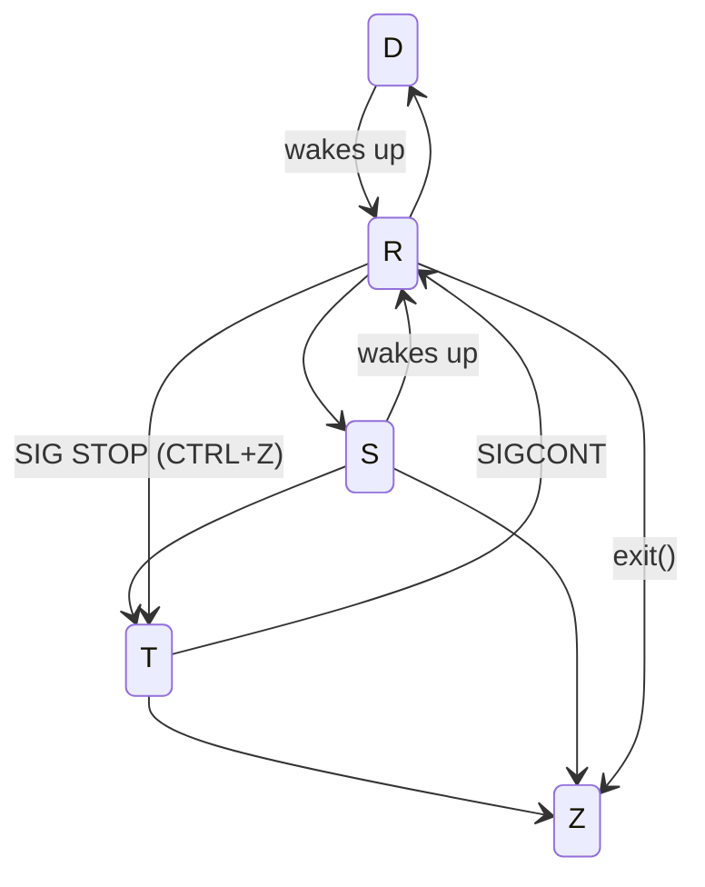

# Processes

A process is a **program** in execution, and the status of the current execution is stored in the **program counter**, as well as other **registers**.

## The Process

- The **text** section comprises the compiled program code, read in from non-volatile storage when the program is launched.
- The **data** section stores global and static variables, allocated and initialized prior to executing main.
- The **heap** is used for dynamic memory allocation, and is managed via calls to new, delete, malloc, free, etc.
- The **stack** is used for local variables. Space on the stack is reserved for local variables when they are declared ( at function entrance or elsewhere, depending on the language ), and the space is freed up when the variables go out of scope. Note that the stack is also used for function return values, and the exact mechanisms of stack management may be language specific.
- **Note** that the stack and the heap start at opposite ends of the process's free space and grow towards each other. If they should ever meet, then either a stack overflow error will occur, or else a call to new or malloc will fail due to insufficient memory available.

## States

- **R**: Running
  - if the CPU executes the process: **RUNNING**
  - if the process is ready to be executed: **RUNNABLE**
- **D**: Uninterruptible sleep
  - will not wake up from any signal
  - even if signals are sent to it
  - can not be killed
- **S**: Interruptible sleep
  - waiting for some event or signal
  - once the signal is received, the process wakes up
  - can be killed via SIGKILL: `kill -9`
- **T**: Stopped
  - suspended
  - `CTRL+Z`
  - only handles `SIGKILL` and `SIGCONT`
- **Z**: Zombie
  - terminated but not yet reaped by its parent
  - kill: `kill -s SIGCHLD parent-pid`

## Scheduling

The objective of multiprogramming is to have some process running at all times so as to maximize CPU utilization.

The role of the process scheduler is to select an available process to run the CPU.

When switching the CPU core to another process a **context switch** is required. The switching requires performing a state save of the current process and a state restore of a different process. This information is stored in the **Process Control Block**. Context switching is pure overhead, because no meaningful work is done.
