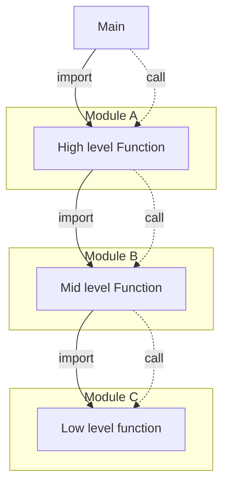
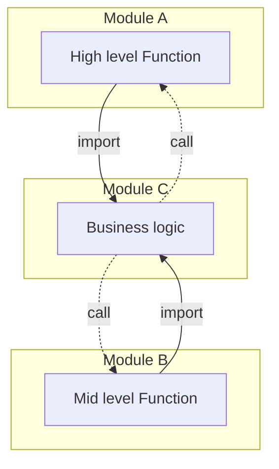

# Polymorphism

A function is **polymorphic**, if ti's behaviors depends on the type of data, that it accepts.

I case of OOP, a polymorphic function has the the same interface/signature for every class, but is implemented differently.

-> Polymorphism makes programs *device independent*
-> Polymorphism enables *independent deployability*
-> Polymorphism enables *independent developability*

## Benefits of Polymorphism
It enables a plugin-like architecture, where each plugin has it's **own implementation of a given interface**. A good example is UNIX. The authors of UNIX noticed, that different IO devices solved similar tasks - only their concrete implementation was different. A Floppy reader, a hard drive and a magnetic tape reader are all storage devices, that read and write binary data from and to a given device. Their interface can therefore be completely identical. As long as every device implements the five basic operations of any `FILE` device :

- `open`
- `close`
- `read`
- `write`
- `seek`

they can be used in any dependent program. If a device changes or a new device is added, the dependent programs do not have to change. It is enough, that the low-level implementation is changed inside the device driver.

##### Funfact
Every UNIX system has a set of file-like devices, that are pure software. Take `/dev/null` or `/dev/urandom` as an example. Both files implement the `FILE` interface completely differently. A **null-device** discards any data that is written to it and returns nothing when reading from it. Reading from `/dev/urandom` instead yields an infinite stream of high quality random binary data.

## Dependency Inversion

Without Polymorphism and interfaces a typical program could look like this:

- **solid lines** mark the source code dependency
- **dotted lines** mark the flow of control

The main function calls a set of higher level functions, that itself may call a set of mid level functions. Such mid level function may call a set of low level functions. These functions may have their own module.

In order to call a function from a different module, the calling function needs to mention the name of the module. In Python this would be an `import` statement at the beginning of the file. Therefore the source code dependencies and the flow of control are **always the same**. It is not possible to call a function implicitly.

By introducing polymorphism things change:

It is possible to rearrange the source code, so that different modules do not need to import each other. Instead, each function is a plugin to the business logic. Thus the business module never needs to import the functions.

### Independent deployability and developability
Because the business module does not depend on Module A or Module B, it is possible to compile each module into it's own binary. Each module can be deployed separately. If any mid-level function changes, only Module B needs to be redeployed. This also makes it possible for different teams to work on each module independently.
