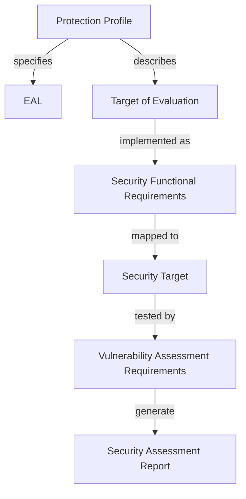

Common Criteria standard (**ISO/IEC 15408**) involves a **rigorous evaluation process**, in which an independent third-party evaluator assesses the product against a set of **predefined security criteria**. The evaluation process involves several stages, including security requirements analysis, security functional testing, vulnerability assessment, and penetration testing.

The goal of Common Criteria Certification is to provide assurance to customers that a product has been independently evaluated and meets a specific level of security. **There are several levels of certification, with higher levels indicating a higher level of security** assurance. Common Criteria Certification is often required by government agencies and other organizations that require a high level of security assurance before purchasing or deploying a product.

## Terms

1.  **Target of Evaluation (TOE)**: The TOE is the ==product or system that is being evaluated== for Common Criteria compliance. It is the subject of the evaluation.

2.  **Protection Profile (PP)**: A PP is a document that ==outlines the security requirements for a specific type of product== or system. It is used as a basis for evaluating the security of a TOE. The PP typically includes a set of security objectives and a set of security requirements that the TOE must meet in order to comply with the PP.

3.  **Security Target (ST)**: An ST is a document that ==specifies the security requirements for a specific TOE==. It is written by the TOE developer or vendor and describes the security functions that are provided by the TOE, as well as the security properties and assumptions that the TOE makes. The ST is typically based on one or more PPs.

4.  **Security Functional Requirements (SFRs)**: SFRs ==specify the security functions== that must be provided by a TOE in order to meet the security objectives defined in the PP. They are written as part of the PP development process and are used to specify the security requirements for a specific TOE in the ST.

5.  **Security Assurance Requirements (SARs)**: SARs are ==requirements that must be met== in order to ensure that the security functions of the TOE are implemented correctly and effectively. They specify the level of assurance that is required for each security function of the TOE.

6.  **Security Functional Testing (SFT)**: SFT is the ==process of testing the security functions== of the TOE to ensure that they meet the requirements specified in the SFRs. SFT is typically performed during the evaluation process.

7.  **Security Assessment Report (SAR)**: The SAR is a document that ==summarizes the results of the Common Criteria evaluation==. It includes information about the TOE, the evaluation methodology, the evaluation results, and any identified vulnerabilities or weaknesses in the TOE.



### Types of Requirements

**Functional Requirements**: These are requirements that specify the functions that a system or subsystem must perform in order to meet its intended purpose. In the context of security evaluations, functional requirements may include things like access control, audit logging, data encryption, and network security features.

**Assurance Requirements**: These are requirements that address the reliability, consistency, and trustworthiness of a system or subsystem. In the context of security evaluations, assurance requirements may include things like testing procedures, quality assurance processes, documentation standards, and the use of approved cryptographic algorithms.

**Vulnerability Assessment Requirements**: These are requirements that specify the methods and procedures that will be used to identify potential vulnerabilities in a system or subsystem. In the context of security evaluations, vulnerability assessment requirements may include things like vulnerability scanning, penetration testing, code review, and configuration audits.

## Protection Profile

A Protection Profile (PP) is a document that outlines the security requirements for a specific type of product or system (**ISO/IEC 15408.**). Every Protection Profile includes security activities with the objective of achieving feasible, repeatable and verifiable evaluations within each category.

Currently there are over two hundred different PP to be found on the [official website](https://www.commoncriteriaportal.org/pps/) of the Common Criteria website. They are grouped into fourteen different categories  based on the type of system they are designed to protect or the security requirements they address. 

For example, some common categories of PPs include:

1.  **Operating systems**: define security requirements for operating systems, such as Microsoft Windows or Linux.
2.  **Network devices**: define security requirements for network devices, such as firewalls, routers, and switches.
3.  **Mobile devices**: define security requirements for mobile devices, such as smartphones and tablets.
4.  **Databases**: define security requirements for database management systems, such as Oracle or Microsoft SQL Server.
5.  **Smart cards**: define security requirements for smart cards, which are used for authentication and secure storage of sensitive information.

If there is an existing PP that fits the product, the process of certification is speeded up significantly, because the following parts are defined already:

-   An assurance level (EAL)
-   A detailed description of the product
-   The definition of the security problem
	- A list of assets, subjects, threats, policies and assumptions is given
-   The Security Targets of the TOE and the environment
-   The SFRs (Functional Safety Requirements) list

## Example (Ubuntu 22.04) with EAL4

These are some basic steps to ensure Common Criteria Compliance (using Ubuntu 22.04 as an example):

1. **Determine the Common Criteria requirements**: First, the Common Criteria requirements that apply to a (sub)system need to be understood. This will depend on the security level required by the project owner. Consult the Common Criteria documentation to determine the specific requirements.

2.  **Select Common Criteria certified hardware**: If the (sub)system is based on COTS hardware, hardware that is Common Criteria certified for the security level required by the project owner should be considered. This will ensure that the hardware meets the specific security requirements and has been evaluated and certified by an independent third-party evaluator.

3.  **Secure the operating system**: Most of the common operating systems are not Common Criteria certified out-of-the-box. However, the operating system may still meet the Common Criteria requirements by using security hardening techniques. This may involve disabling unnecessary services, implementing access control policies, and configuring secure communication channels.

4.  **Conduct Common Criteria evaluations**: Once the (operating) system is secured, Common Criteria evaluations for the system are required. This will involve preparing and submitting documentation to an independent third-party evaluator, who will review the documentation and conduct tests to evaluate the security features of the system. The process may need to be repeated multiple times to achieve the desired level of  Common Criteria compliance.

5.  **Maintain Common Criteria compliance**: Common Criteria compliance is not a one-time event. The system will need to be maintained to ensure that it continues to meet the security requirements and remain compliant with the Common Criteria standards. This may involve periodic evaluations, applying security patches and updates and monitoring the security on an ongoing basis.

The EAL4 security level is a relatively high level of assurance that requires a strong focus on the development of the product, documentation of the development process, and testing of the product's security features. Here are some examples of the security requirements for Ubuntu 22.04 at the EAL4 level:

1.  **Access control**: Ubuntu 22.04 would need to implement strict access control measures to prevent unauthorized access to the system. This may include authentication and authorization mechanisms, such as password policies, user permissions, and file permissions.

2.  **Security functions**: The operating system would need to include a range of security functions, such as security audit logging, security event detection, and cryptographic services. These functions would need to be tested and verified to ensure that they meet the requirements for the EAL4 level.

3.  **Development process**: The development process for Ubuntu 22.04 would need to be carefully documented and include a range of security-focused activities, such as security requirements analysis, security testing, and security validation.

4.  **Assurance requirements**: The EAL4 security level requires a high level of assurance, which means that the operating system would need to undergo extensive testing and evaluation to ensure that it meets the required security standards. This may include penetration testing, vulnerability assessment, and independent evaluation by a third-party evaluator.

5.  **Vulnerability assessment**: Ubuntu 22.04 would need to undergo regular vulnerability assessments to ensure that it remains secure and meets the EAL4 security requirements. This may involve monitoring for security vulnerabilities and applying security patches and updates as needed.
    
## NIST SP 800-53

NIST SP 800-53 is widely used by government agencies, contractors, and other organizations to help secure their information systems. The publication is organized into families of security controls, with each family addressing a specific area of security, such as access control, identification and authentication, or incident response.

In addition to SP 800-53, NIST also provides other publications that provide guidance on securing specific operating systems. For example, NIST SP 800-171 provides requirements for protecting the confidentiality of Controlled Unclassified Information (CUI) in nonfederal systems and organizations, including guidance on securing Microsoft Windows and Red Hat Linux operating systems.

NIST also provides guidance on how to develop secure configurations for operating systems through its Security Configuration Checklists Program. These checklists provide detailed guidance on how to configure operating systems to meet specific security requirements.

The ==security controls are organized into three tiers based on the impact level== of the information system, with Tier 1 being the lowest impact and Tier 3 being the highest impact. The document provides guidance on which controls are required for each tier.

NIST SP 800-53 also includes guidance on security control implementation, assessment, and monitoring. It provides guidance on how to test security controls and how to evaluate the effectiveness of security programs.

### Practical security measures

This is an extensive list of security measures required to secure an operating system according to NIST SP 800-53:

1.  Access Control
	-   Limit system access to authorized users, processes, and devices
	-   Enforce password complexity and expiration policies
	-   Monitor and audit system access and use
	-   Limit user privileges and permissions to the minimum necessary for job functions
	-   Use multifactor authentication for high-risk or high-value activities

1.  Audit and Accountability
	-   Collect and analyze system audit logs
	-   Monitor system activity for signs of unauthorized access or use
	-   Alert security personnel of suspicious activity or anomalies
	-   Review and report on audit log data regularly

2.  Configuration Management
	-   Establish baselines for system configurations
	-   Manage changes to system configurations
	-   Monitor system configurations for compliance with security policies
	-   Maintain an inventory of authorized hardware and software components

3.  Identification and Authentication
	-   Use strong authentication mechanisms, such as passwords, tokens, and biometrics
	-   Ensure that authentication mechanisms protect against password cracking and guessing attacks
	-   Authenticate all users and processes that access system resources
	-   Use unique identifiers to track user activity

4.  Incident Response
	-   Establish and maintain incident response procedures
	-   Train personnel on how to detect and report security incidents
	-   Isolate affected systems to prevent further damage or compromise
	-   Collect and preserve evidence for forensic analysis

5.  System and Communications Protection
	-   Implement security controls to protect against malware, viruses, and other types of malicious software
	-   Use encryption to protect sensitive data in transit and at rest
	-   Implement network security controls, such as firewalls and intrusion detection/prevention systems
	-   Implement physical security controls to protect against theft, tampering, or destruction of system components

6.  System and Information Integrity
	-   Monitor system components for signs of compromise or tampering
	-   Install and maintain anti-virus and anti-malware software
	-   Apply security patches and updates in a timely manner
	-   Perform regular vulnerability assessments and penetration testing to identify and remediate security weaknesses

This list is not exhaustive, and there may be other security measures that are required depending on the specific operating system and the organization's security requirements. However, these measures represent a comprehensive set of security controls that can be used to secure an operating system.

#### Example Playbook
```yaml
---
- name: Secure Ubuntu System
  hosts: all
  become: yes

  tasks:
    # Access Control
    - name: Set password complexity requirements
      lineinfile:
        path: /etc/pam.d/common-password
        regexp: "^password\\s+requisite\\s+pam_cracklib.so"
        line: "password requisite pam_cracklib.so minlen=12 ucredit=-1 lcredit=-2 dcredit=-2 ocredit=-1"
      notify: restart sshd

    - name: Create system user with sudo privileges
      user:
        name: sysadmin
        state: present
        groups: sudo
        shell: /bin/bash
        password: "{{ 'mypassword' | password_hash('sha512') }}"

    # Audit and Accountability
    - name: Configure auditd to log system events
      lineinfile:
        path: /etc/audit/auditd.conf
        regexp: "^log_file\\s*=\\s*"
        line: "log_file = /var/log/audit/audit.log"
      notify: restart auditd

    # Configuration Management
    - name: Install and configure rsyslog
      apt:
        name: rsyslog
        state: present
      lineinfile:
        path: /etc/rsyslog.conf
        regexp: "^\\$ModLoad\\s+imklog"
        line: "$ModLoad imfile"
      copy:
        content: |
          input(type="imfile" File="/var/log/auth.log" Tag="auth" Facility="auth" Severity="info")
        dest: /etc/rsyslog.d/audit.conf
      notify: restart rsyslog

    # Identification and Authentication
    - name: Disable root login over SSH
      lineinfile:
        path: /etc/ssh/sshd_config
        regexp: "^PermitRootLogin\\s+yes"
        line: "PermitRootLogin no"
      notify: restart sshd

    # Incident Response
    - name: Install and configure fail2ban
      apt:
        name: fail2ban
        state: present
      copy:
        src: /etc/fail2ban/jail.conf
        dest: /etc/fail2ban/jail.local
      notify: restart fail2ban

    # System and Communications Protection
    - name: Install and configure ufw
      apt:
        name: ufw
        state: present
      ufw:
        rule: allow
        port: "{{ item }}"
        proto: tcp
      with_items:
        - 22
      notify: restart ufw

    # System and Information Integrity
    - name: Install security updates
      apt:
        name: '*'
        state: latest
      register: update_result
      when: ansible_os_family == "Debian"
      changed_when: update_result.stdout_lines | length > 1
      notify: restart sshd

  handlers:
    - name: restart sshd
      service:
        name: sshd
        state: restarted
    - name: restart auditd
      service:
        name: auditd
        state: restarted
    - name: restart rsyslog
      service:
        name: rsyslog
        state: restarted
    - name: restart fail2ban
      service:
        name: fail2ban
        state: restarted
    - name: restart ufw
      service

```

To document the implementation of the security measures and prove compliance with NIST SP 800-53, a security plan or security control assessment (SCA) report is required.

A security plan should include an overview of the system, security objectives and goals, and a description of the implemented security controls, along with their effectiveness and how they meet the security requirements. It should also include a risk assessment, which identifies and analyzes the potential threats to the system, the likelihood of those threats occurring, and the impact they would have on the system.

An SCA report should document the results of testing and evaluation of the implemented security controls. It should include detailed information on how the security controls were tested, what vulnerabilities were identified, and how those vulnerabilities were mitigated. It should also provide evidence that the security controls are effective and meet the security requirements.
