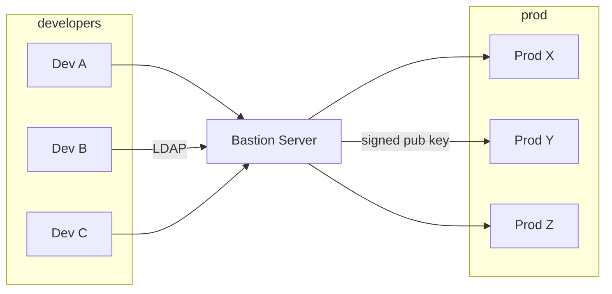

# Scalable And Secure Access with SSH

- single user in `/etc/passwd`
- typically `root`
- authentication using public key infrastructure
- a trusted CA signs public keys
- OpenSSH-Server only accepts logins if the client certificate has some very specific capabilities given by the CA
- no direct access to prod (firewalls)
- use bastion hosts to reach prod
  - access via LDAP/Kerberos
  - after login: a signed SSH certificate is generated
- [how to SSH certificate](https://goteleport.com/blog/how-to-ssh-properly/)

## General Setup

- developers authenticate themselves against the bastion server

- authentication using LDAP

- the AD returns a set of privileges

- the bastion server generates a public SSH key

- encoded a set of principals into the SSH key

- a trusted CA signs the SSH key

  