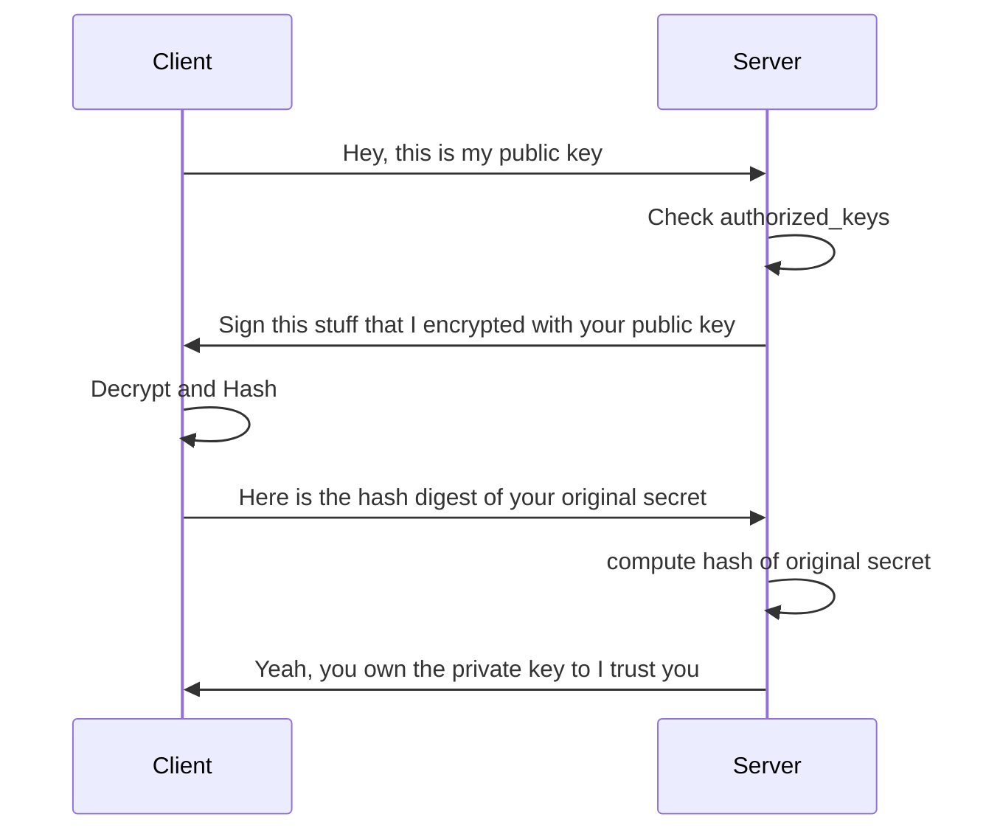
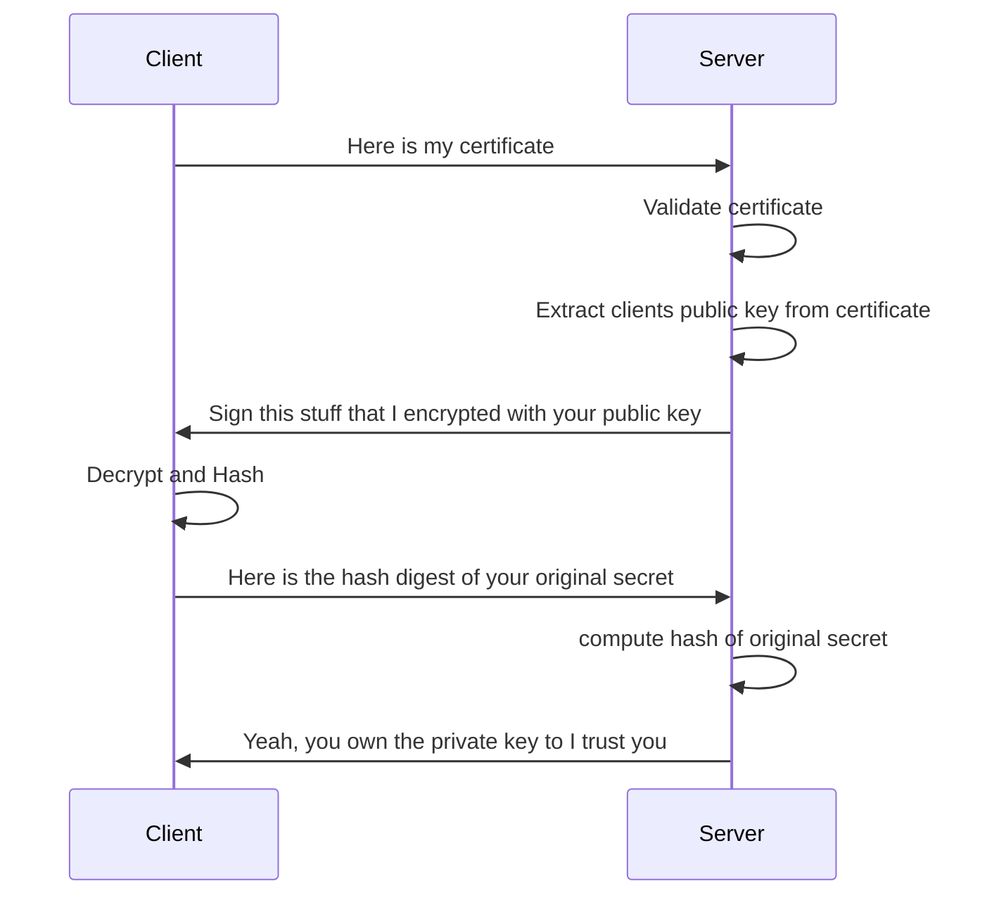

# SSH

## Public Key Authentication

The following overview explains how SSH connections are established:

1. the client sends its public key to the server.
2. the server validates whether the key is allowed by comparing to keys in `authorized_keys`
3. if the key is allowed, the server encrypts a random message with the public key of the client and sends the encrypted message to the client.
4. the client decrypts the encrypted message with its private key then uses SHA256 to hash the decrypted message and sends the hash to the server.
5. the server compares the hash of the original message against the hash received from the client. If the hashes match it means that the pair of keys is valid, and the connection can be established.

## SSH Certificates

SSH certificates are another mechanism to ensure that a given public key can be trusted. It replaces the `authorized_keys` file. Instead of scattering public keys across static files, you bind a public key to a name with a *certificate*

1. **Client sends its certificate to the Server**: During the SSH handshake, the client sends its certificate to the server.
2. **Server verifies the certificate**: The server verifies the client's certificate against a trusted Certificate Authority (CA) or a local trust store. This verification typically involves checking the certificate's validity, the issuer's signature, and whether the certificate is revoked.
3. **Server extracts the public key from the certificate**: If the certificate is valid and trusted, the server extracts the public key from the certificate.
4. **Server encrypts a challenge with client's public key**: Similar to public key authentication, the server generates a random challenge, encrypts it with the client's public key extracted from the certificate, and sends it back to the client.
5. **Client decrypts and hashes the challenge**: The client decrypts the challenge using the private key associated with the public key embedded in its certificate, and then hashes the decrypted challenge.
6. **Client sends the hash back to the Server**: The client sends the hashed challenge back to the server.
7. **Server verifies the hash**: The server verifies the hashed challenge sent by the client against its own computation. If the hashes match, the server trusts that the client possesses the private key corresponding to the public key embedded in the certificate, and authentication succeeds.

**NOTE:** Steps 4 to 7 are the same as for normal public key authentication.

**NOTE:** Take a look at [PROTOCOL.certkeys](https://github.com/openssh/openssh-portable/blob/281ea25a44bff53eefb4af7bab7aa670b1f8b6b2/PROTOCOL.certkeys)

### RSA certificate

    string    "ssh-rsa-cert-v01@openssh.com"
    string    nonce
    mpint     RSA exponent
    mpint     public modulus
    uint64    serial
    uint32    type
    string    key id
    string    valid principals
    uint64    valid after
    uint64    valid before
    string    critical options
    string    extensions
    string    reserved
    string    CA key used to sign the certificate
    string    signature computed over all preceding fields

### Certificate Verification

#### Signing

1. hash the original data, reducing it to fixed length
2. encrypt the hash using the **CAs private key**
3. attach the resulting signature to the certificate

#### Verification

1. hash the original data, reducing it to fixed length
2. decrypt the signature using the **CAs public key**
3. if both results match, the certificate is valid
