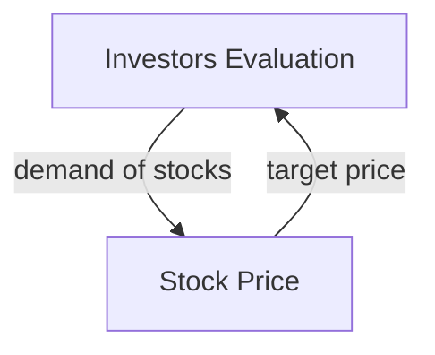

# Systems Terminology

A **system** is an interconnected set of elements that is coherently organized in a way that achieves something.

- **elements**: individual parts or building blocks (atomic)
- **interconnections**: connections/rules/dependencies between elements
- **purpose**: goals or results produced by the system

**Example** _Tree_: A tree is a complex system. The elements include leaves, trunk, roots and branches. Such elements may be systems themselves. Different kinds of leaves have distinct specializations and are made up of elements themselves (fluids, chloroplasts,  veins, ...). Its elements are interconnected to allow the tree to grow (purpose). They include, but are not limited to, flows of fluids and chemical reactions (photosynthesis).

**Many interconnections in a system operate through the flow of information**. Such information holds systems together and plays a great role in determining how they operate.

A **stock** is the memory of the history of changing flows within the system.

- changing over time (filling or draining) through **flows**
- stocks and flows create unique dynamics
- stocks are be increased by:
  - increasing its inflow rate (obvious)
  - decreasing its outflow rate
- inertia: stocks change slowly even when their flows change drastically
  - $\rightarrow$ **stocks act as buffers**
- stocks allow **inflows and outflows to be decoupled** (because they can serve as buffers

A **feedback loop** is a closed chain of causal connections from a stock, through a set of decisions or rules or physical laws or actions that are dependent on the level of the stock, and back again through a flow to change the stock.

**Example** _feedback loop_: 

Investors evaluate a company based on set of criteria and set. Based this evaluation they define a target price for the stock. If the current stock price is lower than the target price, they buy more stocks. This increases demand and reduces the amount of available stocks for sell. In turn, the price for the stocks increases. If the price exceeds the target price, investors will start to sell their stocks. Thus, more stocks become available and the price declines.

