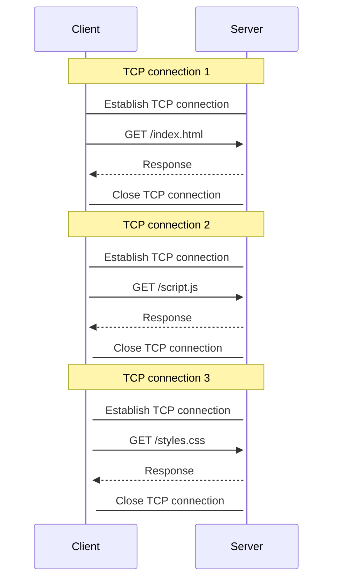
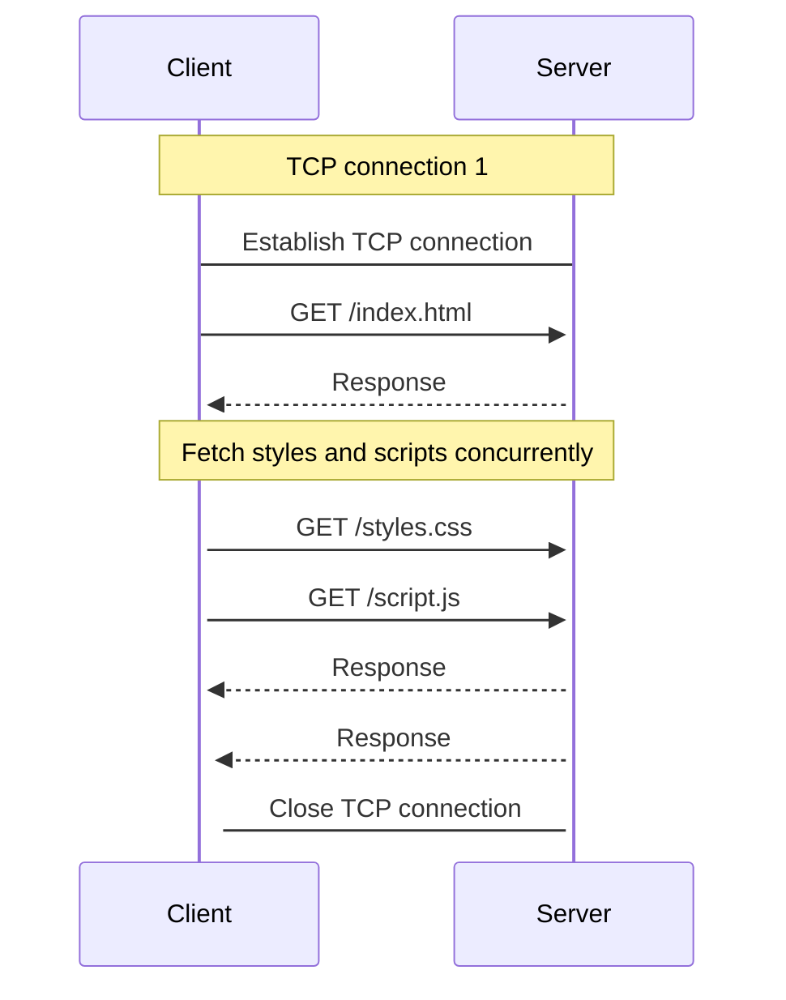

* application layer protocal (OSI layer 7)
* built on top of TCP (transport layer), altough HTTP/3 is based on Googles QUIC protocol
* Client-Server-principle (client requests some data from a server)


## How does it work?

HTTP is a **request-response** protocol in the **client-server model**. The client (e.g. a browser)  always sends a initial request (HTTP request) that is served by the HTTP-server (e.g. a web server). The server then performs some functions on behalf of the client and returns the response (HTTP response) to the client. To speed things up, several HTTP conections take place concurrently.

HTTP is an **application layer protocol**, that historically used TCP/IP for data transport.  But HTTP can theoretically be spoken on any transport layer protocol, as long as it is **reliable** (see Googles QUIC extension). HTTP messages are called request and response. Both consist of a **header** and some **data**. The header is used to store arbitrary **control information**. The data is either the response from the server or some user input from the client. 

HTTP is designed to allow intermediate network elements. In such networks other servers can respnd on behalf of the actual HTTP server, e.g. to enable load balancing.

## HTTP versions compared

* **HTTP/1.0**
	* separate connection to the same server is required **for every resource**
* **HTTP/2**
	* revision of both HTTP/1.0 and HTTP/1.1 with several improvements
	* compressed headers (smaller, less traffic)
	* used a single [[TCP-IP-Model|TCP/IP]] connection to transfer multiple requests and responses in parralel (stream multiplexing)
	* adds a push capability (servers can push data to client, instead of clients asking for data periodically)
	* HTTP messages are encapsulated into several frames (making them **non human readable**)
* **HTTP/3**
	* revision of HTTP/2 in order to use Googles QUIC transport protocol

## HTTP addressing

HTTP resources are identified und located by URLs using the URI schemes `http` and `https`. The required RFC is [3986](https://datatracker.ietf.org/doc/html/rfc3986). The URL is stored in the header of the HTTP request.

## HTTP cookie

HTTP is a stateless protocol. This means that the web server can not establish any context between consequent requests of the same client. While this suffies for simple information exchange, the principle is not suitable for application-orientated websites. Typically, the online store is given as an example, where the user authenticates once and stays logged in from then on.

A cookie is a simple textual information. It-s format looks like:

```
"Set-Cookie:" Name "=" Value *( ";" Attribute)
"Cookie:" Name "=" Value *( ";" Name "=" Value)
```

Cookies are sent to the server as part of the HTTP header **for every request**, but can also be accessed through Javascript by the browser. Arbitrary data may be stored as a cookie using base64 encoding. 


## HTTP flow

1. At first a TCP connection betwee client and server is established. This connection is used to send a single request (HTTP/1) or multiple requests (HTTP/2).
2. Send an HTTP message
3. Read and interpretate the response
4. Either close or reuse the connection for further use


## HTTP Requests

An HTTP request could look like this:

```txt
GET / HTTP/1.1
Host: developer.mozilla.org
Accept-Language: fr
```


- `GET` is the HTTP method used. This verb (PUT, PATCH, GET, ...) defines the operation that the client wants to perform
- the URL `/` tells the path to the resource that the client wants to retrieve
- also the version fof the protocol is passed
- any number of HTTP headers that convey additional information are included
- the data is stored in the HTTP body

## HTTP response

An HTTP response could look like this:

```txt
HTTP/1.1 200 OK
Date: Sat, 09 Oct 2010 14:28:02 GMT
Server: Apache
Last-Modified: Tue, 01 Dec 2009 20:18:22 GMT
ETag: "51142bc1-7449-479b075b2891b"
Accept-Ranges: bytes
Content-Length: 29769
Content-Type: text/html

<!DOCTYPE html...
```

- `HTTP/1.1` is the version of the protocol
- `200` is the status code
- `OK` is the status message
- any number of HTTP headers that convey additional information are included
	- `Content-Type: text/html` tells the client to interpret the payload as HTML
- the body contains the response data of the server (for example HTML)


## HTTPS

HTTPS adds encryption and authentication to HTTP. **SSL/TLS ** is responsible for authentication and encryption. It interposes itself between HTTP and the TCP transport protocol. SSL/TLS is thus also available for other application protocols. 

- **Message-integrity**: None can intercept and manipulate the messages as a **man-in-the-middle**
- **Confidentiality**: None can see **what is transfered**
- **Authenticity**: The client can be sure that it talsk to the legitimate server. This is ensured by **public key infrastructure** and certificates.


## HTTP multiplexing

#### HTTP/1.1




#### HTTP/2



## Resources
- https://www.objc.io/issues/10-syncing-data/ip-tcp-http/
- https://www.elektronik-kompendium.de/sites/net/0902231.htm
- https://developer.mozilla.org/de/docs/Web/HTTP