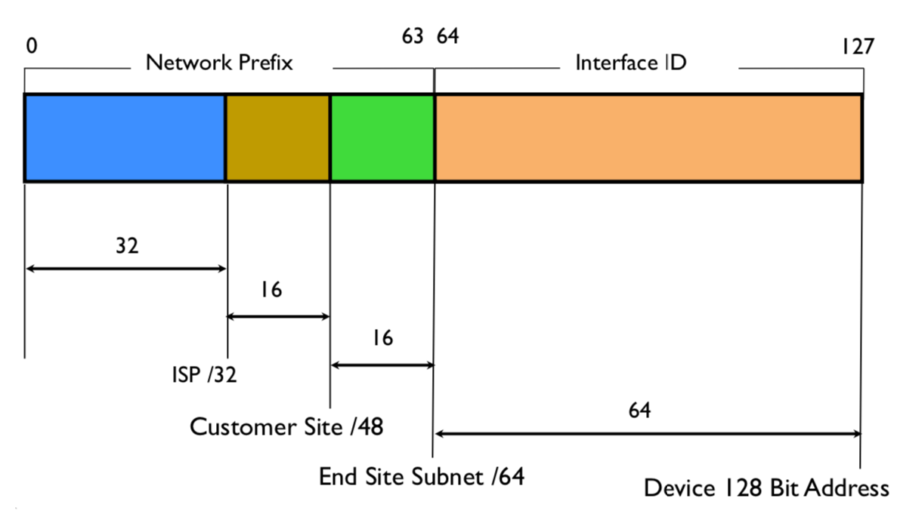

# IPv6

## Dual Stack

Modern operating systems support that a host has an IPv4 and IPv6 address simultaneously. This is used to make the transition from IPv4 to IPv6 easier, because services can be migrated one after another. The only downside is the added complexity. Some things need to be configured twice (routing, firewalls, etc.).

### Address Selection

- a host has both: a global IPv4 and a global IPv6 address
- the host chooses the type of connection for **each new outgoing connection**
- RFC6723 says that IPv6 is preferred over IPv4
- sometimes hosts deviate from this and prefer the faster connection
- /32 is the minimum prefix allocation
- /48 is the minimum prefix size that will be routed globally via BGB
- /64 is the common size for one subnet

## IPv4 vs IPv6

|   Difference   |            IPv4            |              IPv6               |
| :------------: | :------------------------: | :-----------------------------: |
|   Bit length   |          32 bits           |            128 bits             |
|    Checksum    | header field for checksums |               no                |
| Fragmentation  |  possible a long the path  |     done only by the sender     |
| Address types  | Uni-,broad- and multicast  |     uni-,multi- and anycast     |
| Configuration  |           DHCPv4           | Auto configuration capabilities |
|  Network MAsk  |            yes             |       uses prefix instead       |
| MAC resolution |            ARP             |  Multicast Neighbor Discovery   |

### How does IPv6 auto configuration work?

IPv6 uses SLAAC (Stateless Address Autoconfiguration) for stateless configuration of IPv6 addresses on a given interface. It is possible to retrieve a link locale and a global IPv6 address. 

- all link locale addresses start with the prefix `fe80:0000:0000:0000/64`
- the suffix (interface identifier) is the EUI-64 identifier
  - split the host MAC address in the middle
  - invert the second bit of the first octet
  - insert the two bytes `ff:fe` between the two halfes
  - `00:0C:F1:8E:C1:D8` -> `00:0C:F1` and `8E:C1:D8`
  - invert second bit `00` -> `02`
  - insert `ff:fe` -> `02:0C:F1:FF:FE:8E:C1:D8`
  - the final address is then: 
    - `fe80:0000:0000:0000:020C:F1FF:FE8E:C1D8`
- before actually using this address a Duplicate Address Detection is required
  - Neighbor Solicitation: Does anyone use this address (Multicast)
  - Neighbor Advertisement: If someone answers, this address is used
- after the host has a link locale address, it can request a global address:
  - Router Solicitation: Ask `ff02::2` for a global prefix
  - Router Advertisement: The next router answers with the global prefix and the MTU
  - the router also sets the **autonomous** flag
- because the MAC address is globally unique, this allows for tracking. Therefore privacy extensions are used to obfuscate the MAC address

### Why does IPv6 does not have header fields for checksums and fragmentation?

Speed. IPv6 was designed to be more efficient than IPv4. Therefore, several decisions were made to speed up the processing of IP packets. Thus, the IP header was greatly simplified and is **fixed length** (unlike in IPv4). Also it is not possible to fragment IPv6 packets along the path, as it can be done with IPv4. This is also the reason why Path MTU Discovery is so important in IPv6.

The checksum was removed in IPv6 because it is mostly redundant. All link layer protocols (Ethernet) provide a checksum. So only the payload itself may contain logic errors. But almost all transport protocols like TCP/UDP have error checking to catch logic errors. Most of these checksums do cover most of the IP header as well (pseudo header).

## Firewall Gotchas

IPv6 uses ICMPv6 for the address resolution. ICMPv6 is based on the IPv6 protocol itself. Therefore, these packets can not be filtered by the firewall. Refer to RFC4890 for Firewall Recommendations.

## IPv6 Addressing

IPv6 support three types of addresses:

- **Unicast**: identify a single interface
- **Anycast**: identify a set of interfaces in such a way that a packet sent to an anycast address is delivered to a member of the set
- **Multicast**: indentify a group of interfaces in such a way that a packet sent to a multicast address is delivered to all interfaces in the group

| Prefix    | Comment                                  | Example/IPv4 Equivalent      |
| --------- | ---------------------------------------- | ---------------------------- |
| ::/128    | unspecified bind address                 | 0.0.0.0                      |
| ::1/128   | loopback interface                       | 127.0.0.1                    |
| ::ffff/96 | IPv4 mapped                              | ::ffff:192.0.2.1 |
| fc00::/7  | Unique local address (RFC 4193)          | RFC1918 address (10.0.0.0/8) |
| fe80::/10 | Link local Address (54 bits are often 0) | 169.254.0.0/16 |

### Address structure

- /32 is the typical allocation for a network operator
- /48 is the minimum prefix length that will be globally routed via BGP
- a subnet is typically a /64

### Unique local unicast addresses (ULA)

- globally unique prefix (with high probability of uniqueness).
- well-known prefix to allow for easy filtering at site
boundaries.
- allow sites to be combined or privately interconnected without
creating any address conflicts or requiring renumbering of
interfaces that use these prefixes.
- internet Service Provider independent and can be used for
communications inside of a site without having any permanent or
intermittent Internet connectivity.
- if accidentally leaked outside of a site via routing or DNS,
there is no conflict with any other addresses.
- in practice, applications may treat these addresses like global
scoped addresses.
- comparable (but not the same) to IPv4 RFC1918 addresses
- defined in [RFC 4193](https://tools.ietf.org/html/rfc4193)
- 7 bits prefix
- 8th bit is 1 as for all local addresses
- 40 bits for global ID
	- is globally unique
	- pseudo-random
	- Global ID isn’t assured to be unique, but chances are high that it is
- 16 bits for subnet ID
- 64 bits for interface ID
- the L bit is always 1, because the global ID is not guaranteed to be globally unique
	- all valid ULAs thus start with `fd00::/8`
	- 7 bits prefix + 1 bit L bit 

## Best Practice for IPv6 prefix assignment

Some best practises based on recommendations from [RIPE](https://www.ripe.net/publications/docs/ripe-690) and [APNIC](https://blog.apnic.net/2020/06/01/why-is-a-48-the-recommended-minimum-prefix-size-for-routing/).

### Generic recommendations

- **IPv4 != IPv6**. There is not risk of exhausting the IPv6 address space any time soon. Therefore, it is considered good practice to assign each end-user site a short prefix, so that they can have as many subnets (/64) as they want.
- is it **strongly discouraged** to assign prefixes longer than /56 as an operator to endusers
	- the gold standard is a /48 for each end user
	- /56 is still okay
	- /64 is only viable for cell phones
- RIPE recommends a persistent prefix unless there are **privacy concerns** in which case a non-persistent prefix can be used.

### Prefix assignment options

#### /48 for everybody

- there is enough address space to assign a /48 to every human on earth for the next 480 years (or so)
- offers more flexibility for end-users and their addressing schemes
- `2001:db8::/40` then becomes:
    - `2001:db8:aaaa::/48`
    - `2001:db8:aaab::/48`
    - `2001:db8:aaac::/48`
    - `...`
    - `2001:db8:ffff::/48`
    - the enduser can then use `2001:db8:aaaa:XXXX::/48` to make its own addressing plan

#### longer than /56

- **strongly discouraged**
- /64 or longer does not conform to the IPv6 standard