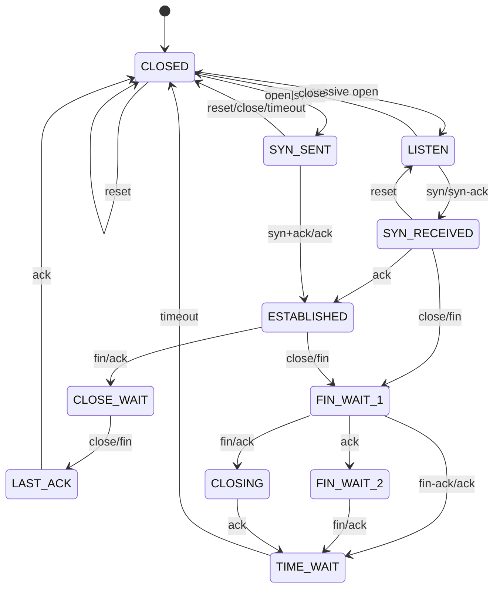
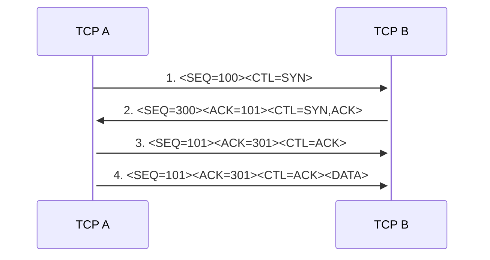
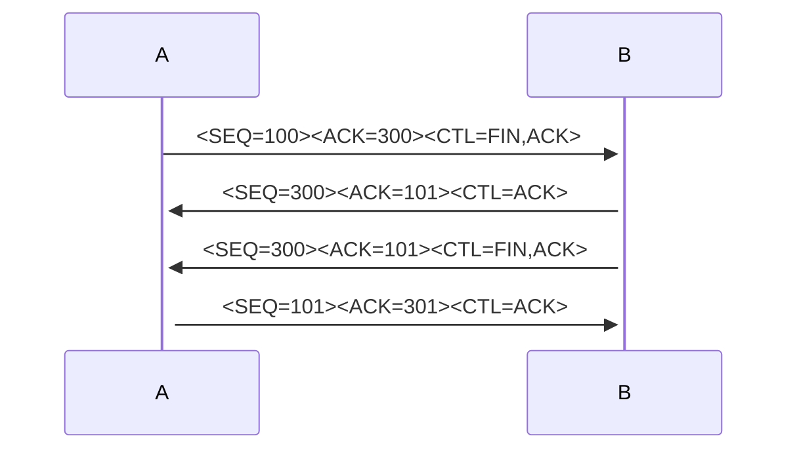
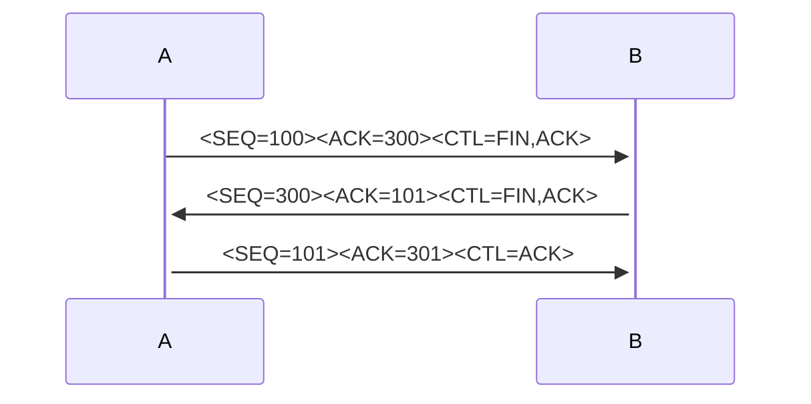

# TCP

- defined in [RFC 793](https://www.ietf.org/rfc/rfc793.txt
- the Internet Protocol (IP) is used on the transport layer
- designed to highly reliable host-to-host packet exchange
- reliable inter-process communication 
- implements mechanisms for congestion control to ensure availability

## TCP is a layer 4 protocol

+---------------------+
|     higher-level    |
+---------------------+
|        TCP          |
+---------------------+
|  internet protocol  |
+---------------------+
|communication network|
+---------------------+

- TCP builds on the IP protocol
- the Internet protocol ensures:
  - addressing source and destination
  - fragmentation of individual TCP segments (to fit through multiple networks and interconnecting gateways)
- but the Internet protocol does not ensure:
  - that packets are received in order
  - that packets are delivered (unreliable)
  - that packets are not duplicated
  - that the network is not overwhelmed (congestion control)
- TCP provides Multiplexing by providing a set of addresses or ports within each host
  - so many processes on the same host can use TCP simultaneously
  - a tuple of **(addresses, port)** form a socket that **uniquely identifies each connection**

## TCP header format

0                   1                   2                   3   
0 1 2 3 4 5 6 7 8 9 0 1 2 3 4 5 6 7 8 9 0 1 2 3 4 5 6 7 8 9 0 1 
+-+-+-+-+-+-+-+-+-+-+-+-+-+-+-+-+-+-+-+-+-+-+-+-+-+-+-+-+-+-+-+-+
|          Source Port          |       Destination Port        |
+-+-+-+-+-+-+-+-+-+-+-+-+-+-+-+-+-+-+-+-+-+-+-+-+-+-+-+-+-+-+-+-+
|                        Sequence Number                        |
+-+-+-+-+-+-+-+-+-+-+-+-+-+-+-+-+-+-+-+-+-+-+-+-+-+-+-+-+-+-+-+-+
|                    Acknowledgment Number                      |
+-+-+-+-+-+-+-+-+-+-+-+-+-+-+-+-+-+-+-+-+-+-+-+-+-+-+-+-+-+-+-+-+
|  Data |           |U|A|P|R|S|F|                               |
| Offset| Reserved  |R|C|S|S|Y|I|            Window             |
|       |           |G|K|H|T|N|N|                               |
+-+-+-+-+-+-+-+-+-+-+-+-+-+-+-+-+-+-+-+-+-+-+-+-+-+-+-+-+-+-+-+-+
|           Checksum            |         Urgent Pointer        |
+-+-+-+-+-+-+-+-+-+-+-+-+-+-+-+-+-+-+-+-+-+-+-+-+-+-+-+-+-+-+-+-+
|                    Options                    |    Padding    |
+-+-+-+-+-+-+-+-+-+-+-+-+-+-+-+-+-+-+-+-+-+-+-+-+-+-+-+-+-+-+-+-+
|                             data                              |
+-+-+-+-+-+-+-+-+-+-+-+-+-+-+-+-+-+-+-+-+-+-+-+-+-+-+-+-+-+-+-+-+

- **Source Port / Destination port**: together with the IP address this uniquely identifies each connection
- **Sequence Number**: The sequence number of the first data octet in this segment
- **Acknowledgment Number**: the next sequence number the sender of the segment is expecting to receive 
- **Data Offset**: number of 32 bit words in the TCP Header
- **Window**: max number of data octets that the sender of this segment is willing to accept
  - this is the max number of data octets that can be sent without the sender needing wait for an **ACK**
- **Checksum**: one's complement of the one's complement sum of all 16 bit words in the header and text

## TCP state machine

## Three-way handshake

- at 1. A initiates the connection by sending a **SYN** segment
  - it uses the sequence number 100
- B responds with a **SYN** and **ACK**knowledges the SYN it received from A
  - because B received the segment with the sequence number 100 it is now expecting to hear sequence 101. Thus is acknowledges sequence 100
- in 3. A sends an empty segment acknowledging Bs last SYN
- from now on (step 4. +) A sends some data

- NOTE: Before a client can connect to a server the server must first bind an listen to a socket: **this is called passive open**
- NOTE: the initial sequence number is random

## Connection Termination

- termination requires a pair of **FIN and ACK** segments
- at first A sends a FIN
- B responds with a ACK and acknowledges sequence 100
- then B send a FIN which is in turn **ACKd** by A
- NOTE: After the side that sent the first FIN has responded with the final ACK, it waits for a timeout before finally closing the connection, during which time the local port is unavailable for new connections; this prevents possible confusion that can occur if delayed packets associated with a previous connection are delivered during a subsequent connection. 

It is possible to save a segment, when B replies with a FIN & ACK(combining two steps into one) and host A replies with an ACK:

## SACK

## Sliding Window

The simplest possible way to reliably send segments is **Stop-and-wait**.
This means that one segment is transmitted at a time. The sender then waits for this segment to be acknowledged. If the sender receives an ACK for the last segment, it sends the next segment. If the sender does not receive a matching ACK after a given timeout, it repeats the last segment. But this would be slow and very inefficient.

We can improve overall throughput by allowing the sender to continue to transmit, sending Data[N+1] (and beyond) without waiting for ACK[N]. We cannot, however, allow the sender get too far ahead of the returning ACKs. Packets sent too fast, as we shall see, simply end up waiting in queues, or, worse, dropped from queues. If the links of the network have sufficient bandwidth, packets may also be dropped at the receiving end.

The basic idea of sliding windows is that the sender is allowed to send **WINDOW_SIZE** many packets before waiting for an ACK.

Let the window size be 4. And let there be a total of 10 segments to be transmitted. Then the sender can start to send the first 4 segments at once:

[ [1, 2, 3, 4], 5, 6, 7, 8, 9, 10 ]

If ACK[1] arrives the window can move forward and the sender can send the next segment:

[ 1, [2, 3, 4, 5,] 6, 7, 8, 9, 10 ]

If ACK[5] arrives, the sender can move its window further by multiple segments. This is because the receiver **always ACKs the last segment for which it has all prior segments**.

[ 1, 2, 3, 4, 5, [6, 7, 8, 9,] 10 ]

This means that there are many segments in transit at any given time.

## Congestion Control

## Resources

- Diagrams: https://www.cs.montana.edu/courses/spring2004/440/topics/15-transport/lectures/slideset2.pdf
