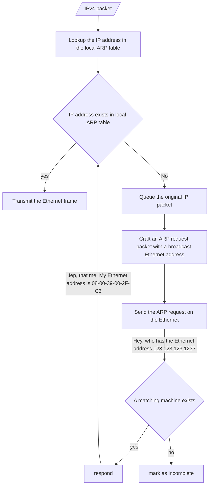

# Address Resolution Protocol(ARP)

ARP is a Layer-2 protocol used to translate IP addresses into Ethernet addresses (MAC). Once the Ethernet address is known the packet can be sent to the  correct network interface (e.g. switch port). ARP is only used for IPv4. IPv6 uses the Neighbor Discovery Protocol (NDP). ARP *sits* between the IP and Ethernet layers, as it is needed to lookup the destination Ethernet address.

## ARP table
The result of the ARP request is stored inside the ARP table in memory. This table contains a row for each network device. Each row has two columns:

1. the IP address
2. the Ethernet address

The Ethernet address is selected by the manufacturer of the device and globally unique. It always remains the same for a given device. The IP address on the other hand may change frequently.

On Unix systems the ARP table can be viewed with:

`arp -a`

## Workflow

### Global
IP implementations can decide if a packet needs to be routed across network borders. If the packets destination is a local computer ARP is used to get the targets machine Ethernet address. If the destination is in another network the IP packet is forwarded to the router. In this case ARP is used to obtain the routers Ethernet address.

