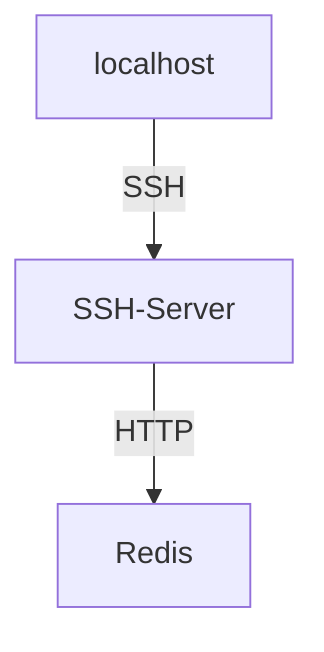
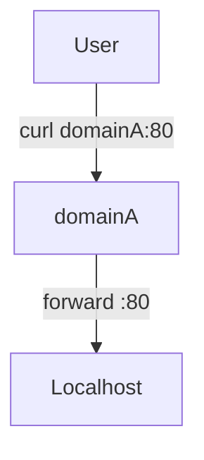

# SSH Tunnel
SSH tunneling is a method of transporting arbitrary data over an encrypted [[fundamentals/protocols/ssh/Fundamentals | SSH]] connection. As the name suggests SSH (Secure Shell) is an secure protocol. This basically means, that communication happens through an encrypted TCP connection. Therefore SSH is a standard for secure remote logins and file transfers over untrusted networks.


## Usecases
- forwards connections from a port on a local system to a port on a remote host
- access a private, remote service (sql-server, redis, postgres, etc.)
- bypass firewalls
- bypass proxies
- secure communication in a otherwise untrusted network
- accessing private services 


### Local port forwarding

- access a remote service as if it were local
- access private services
- bypass firewall/proxy
- use the `-L` flag for `local`

Imagine that you want to access an internal service that is separated from the rest of the network. By using local port forwarding you can forward traffic through SSH to some destination as if the service were local. 



In order to create a tunnel, you can use the following command:

```bash
$ ssh -L <LOCAL_PORT_TO_LISTEN>:<REMOTE_HOST>:<REMOTE_PORT> <SSH_SERVER>
```

Imagine that you want to access a internal Redis server (`redis-server`) that listens on 6379. This server is not publicly accessible. But you have SSH access to an computer (`ssh-server`) that is in the same private network and that can access the Redis server. Then you would establish a SSH tunnel via:

```bash
$ ssh -L 6379:redis-server:6379 ssh-server
```

You now have access to the private redis-server on your local machine at port 6379 (`6379`).

If you access `localhost:6379` on your local system, that traffic will be forwarded to port 6379 on `redis-server` through `ssh-server`. From the perspective of `redis-server`, the traffic originates from `ssh-server`.

**IMPORTANT**
The tuple of `port:domain:port` is relative to the gateway, not from where the tunnel is initiated. 

```bash
$ ssh -L 1234:localhost:1234 home (executed from work)
```

The above command will forward localhost from home to work and not not localhost on work - even if the command is issued on work.


### Remote forwarding
- forwards a port on a remote system to another system


```bash
$ ssh -R <REMOTE_PORT>:<LOCAL_HOST>:<LOCAL_PORT> <SSH_SERVER>
```

The arguments are now reversed:

* REMOTE_PORT is the port on the remote (`ssh-server`)
* LOCAL_HOST is the local address that the traffic is routed to
* LOCA_Port is the local port that the traffic is routed

