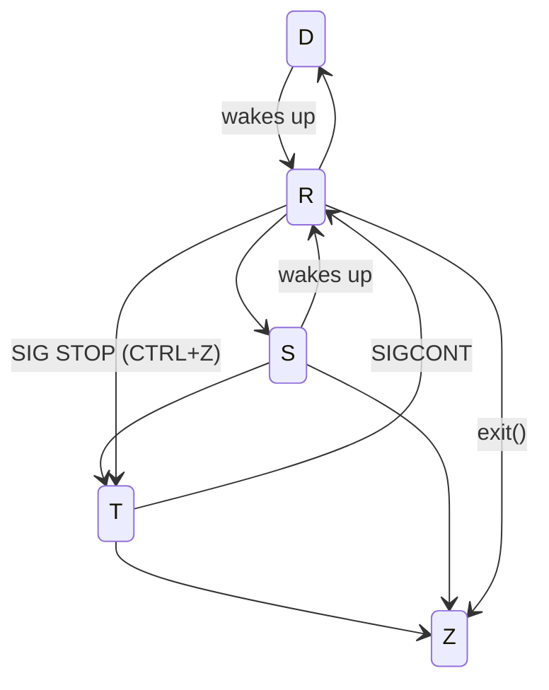

# Processes

TBD

## States

- **R**: Running
	- if the CPU executes the process: **RUNNING**
	- if the process is ready to be executed: **RUNNABLE**
- **D**: Uninterruptible sleep
	- will not wake up from any signal
	- even if signals are sent to it
	- can not be killed
- **S**: Interruptible sleep
	- waiting for some event or signal
	- once the signal is received, the process wakes up
	- can be killed via SIGKILL: `kill -9`
- **T**: Stopped
	- suspended
	- `CTRL+Z`
	- only handles `SIGKILL` and `SIGCONT`
- **Z**: Zombie
	- terminated but not yet reaped by its parent
	- kill: `kill -s SIGCHLD parent-pid`