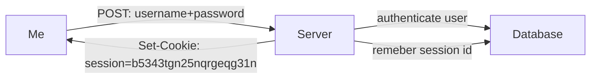
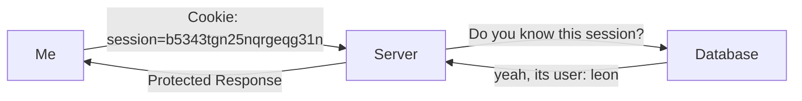

# Traditional authentication

1. I log in with my username and password
   1. the server verifies the password and authenticates me
   2. the server creates a long random string, the session ID, and stores it in the some kind of database
2. The server then responds with a HTTP answer including the session ID (`Set-Cookie: session=b5343tgn25nqrgeqg31n`)
   1. my browser then stores this cookie in my local storage
3. from now on my browser includes this session id for every request it makes (as long as the token is valid)
4. the server notices the session id in my subsequent requests and retrieve the actual user info from the database through the id
5. if the server finds a valid entry for the given session id and the user actually exists, then the server allow the action

## Flowchart for login

## Flowchart for authentication

## Short comings

- one DB lookup for each request
  - requires additional resources
  - slows server and DB
  - adds a delay to every request -> slow down response time
  - addition point of failure

### Improvements

- store the session state in memory
  - single server only
- save the token to a **fast** key-value db like Redis
- [JWT](../web/JWT.md) is [not a perfect alternative](https://redis.com/blog/json-web-tokens-jwt-are-dangerous-for-user-sessions/)